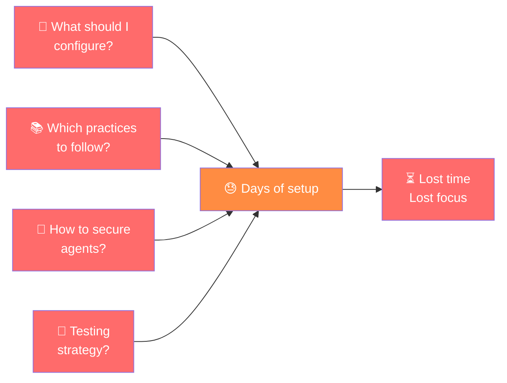
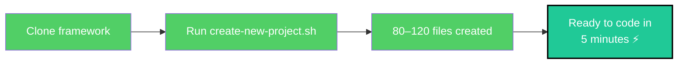
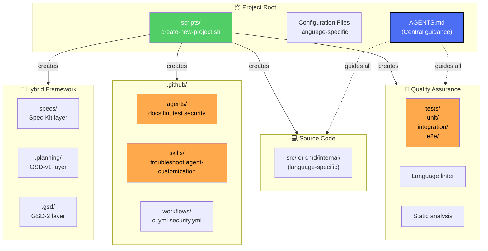

# Agentic Engineering Scaffolding for VS Code

> A **multi-language project scaffolding system** designed to help developers **start working with agentic engineering** in Visual Studio Code. It provides production-ready configurations, AI agent instructions, security hardening, and best practices — all bootstrapped with a single interactive command.

[](https://github.com/OWNER/REPO/actions/workflows/ci.yml)
[](LICENSE)
[](#author)

---

## What is this?

This project is your **starting point for agentic engineering with AI assistants** (GitHub Copilot, Claude Code, Cursor, Windsurf). It eliminates days of setup and configuration by providing:

✅ **One-command project initialization** — 80–120 files configured automatically
✅ **Multi-language** — Go, TypeScript, Python, Ruby, C (select interactively)
✅ **Unified agent instructions** — GitHub Copilot, Claude, and other AI tools read the same guidance
✅ **Agent personas** — `.github/agents/` with docs, lint, test, security roles
✅ **Custom skills** — `.github/skills/` with troubleshoot and agent-customization skills
✅ **Security hardened** — Pre-commit hooks block secrets; OWASP A02 best practices
✅ **80% test coverage threshold** — per-language test setup pre-configured
✅ **GitHub workflows** — CI/CD, security scanning ready
✅ **VS Code optimized** — Settings, extensions list, tasks configured
✅ **Auto-update** — Framework updates itself before scaffolding each project

---

## Quick start

```bash
# 1. Clone the framework
git clone https://github.com/lfarizav/hdd-gsd2-hybrid-framework.git
cd hdd-gsd2-hybrid-framework

# 2. Create a new project (fully interactive)
bash scripts/create-new-project.sh
# Prompts: project name → parent dir → language → GitHub options

# 3. Open your new project
code /path/to/your-new-project

# 4. Fill in the constitution (required before planning)
# Edit specs/constitution.md — replace all placeholder text
```

```

## Hybrid Framework: Spec-Kit + GSD-v1 + GSD-2

This project implements a **three-layer hybrid framework** for enterprise-grade agentic engineering:

| Layer | Framework | Role | Status |
|-------|-----------|------|--------|
| **Definition** | [Spec-Kit](https://github.com/github/spec-kit) (92.1K ⭐) | Requirements governance, constitutional clarity | ✅ Ready |
| **Planning** | [GSD-v1](https://github.com/gsd-build/get-shit-done) (59.3K ⭐) — @glittercowboy/gsd-build | Context engineering, agent orchestration | ✅ Ready |
| **Execution** | [GSD-2](https://github.com/gsd-build/gsd-2) (7K ⭐) — @glittercowboy/gsd-build | Autonomous execution, state management | ✅ Ready |

**See [HYBRID_FRAMEWORK_GUIDE.md](HYBRID_FRAMEWORK_GUIDE.md) for complete integration guide.**

### Quick Overview

```

Spec-Kit (Define) → GSD-v1 (Plan) → GSD-2 (Execute)
↓ ↓ ↓
Specifications Context- Autonomous

- Constitution Engineered Building
- Quality Gates Planning

````

**Example workflow:**
```bash
# 1. Define: Create specifications
echo "# Constitution" > specs/constitution.md

# 2. Plan: GSD-v1 planning with Spec-Kit context
/gsd-new-project --constitution specs/constitution.md

# 3. Execute: GSD-2 autonomous execution (overnight)
gsd /gsd auto

# 4. Verify: Compliance gates
spec-kit gate verify-artifacts
````

See [HYBRID_FRAMEWORK_GUIDE.md](HYBRID_FRAMEWORK_GUIDE.md) for:

- 📖 Deep dives on each framework
- 🔗 Integration patterns (layer-to-layer)
- 👥 Team collaboration workflows
- ⚡ Command cheat sheets

---

## Project Scaffold

All scaffolding is done through **one interactive command**: `create-new-project.sh`. It orchestrates everything automatically.

### Run the scaffold

```bash
bash scripts/create-new-project.sh
```

The script prompts you interactively and then:

1. Checks for framework updates and pulls the latest
2. Calls `scaffold-project.sh` — creates base infrastructure
3. Calls `scaffold-hybrid-framework.sh` — adds hybrid framework layers
4. Makes an initial git commit
5. _(optional)_ Creates a GitHub repo

**Need to update the framework itself?**

```bash
bash scripts/update-framework.sh
```

### What gets created

**80–120 files across all categories:**

| Category             | Files                                                                                          | Purpose                                                                                               |
| -------------------- | ---------------------------------------------------------------------------------------------- | ----------------------------------------------------------------------------------------------------- |
| **Instructions**     | `AGENTS.md`, `CLAUDE.md`, `.instructions.md`, `.github/copilot-instructions.md` (symlinks)     | Single source of truth for all AI agents — minimal, research-backed requirements per arXiv:2602.11988 |
| **Agent personas**   | `.github/agents/docs-agent.md`, `lint-agent.md`, `test-agent.md`, `security-agent.md`          | Domain-specific AI agent roles                                                                        |
| **Skills**           | `.github/skills/troubleshoot.md`, `agent-customization.md`                                     | Custom GitHub Copilot skills                                                                          |
| **Security**         | `.gitignore`, `.env.example`, `.github/hooks/pre-commit`                                       | OWASP A02 secrets protection                                                                          |
| **GitHub**           | PR template, issue templates, workflows (CI/CD, security), CODEOWNERS                          | Standardised collaboration and automation                                                             |
| **VS Code**          | `settings.json`, `extensions.json`, `tasks.json`, `.editorconfig`                              | Consistent editor experience                                                                          |
| **Language tooling** | Language-specific config (Go: `go.mod`+`Makefile`; TS: `tsconfig.json`+`jest.config.js`; etc.) | Per-language build, test, lint setup                                                                  |
| **Documentation**    | `CONTRIBUTING.md`, `README.md`, `CHANGELOG.md`, `LICENSE`                                      | Developer onboarding and project standards                                                            |

### Key features

#### Single source of truth via symlinks

All AI agents (GitHub Copilot, Claude Code, VS Code Agent, Cursor, Windsurf) read **one file**: `AGENTS.md`. This is implemented using **symbolic links** (symlinks), not separate files with references.

**Why symlinks instead of file copies or references?**

According to Wikipedia:

> A **symbolic link** is a special file that stores a path to another file, providing "an alternative access path without duplicating the target's content." The file system automatically treats the symlink as an alias to the target — any software reading the link immediately sees the target's content, without needing to know about symlinks.

**Single Source of Truth (SSOT) advantages** (per Wikipedia SSOT article):

> "Single source of truth architecture is the practice of structuring information models such that every data element is mastered (or edited) in only one place." The benefits include "easier prevention of mistaken inconsistencies (such as a duplicate value/copy somewhere being forgotten) and greatly simplified version control."

**Comparison:**

| Approach                                             | Issues                                                                          |
| ---------------------------------------------------- | ------------------------------------------------------------------------------- |
| **File with link reference** (e.g., "See AGENTS.md") | Creates duplication, drift risk, manual updates needed                          |
| **Symlinks (current)**                               | Single authoritative file; changes auto-reflect; tools unaware of link overhead |

**Implementation:**

```bash
# All three symlinks point to the same file
CLAUDE.md → AGENTS.md
.instructions.md → AGENTS.md
.github/copilot-instructions.md → ../AGENTS.md
```

When any tool reads `.github/copilot-instructions.md`, the OS automatically resolves the symlink and serves `AGENTS.md`. If `AGENTS.md` is updated, all three paths instantly reflect the change—no manual syncing needed.

- **One source of truth**: AGENTS.md + 3 symlinks (CLAUDE.md, .instructions.md, .github/copilot-instructions.md) — all tools read the same file
- **Minimal, research-backed**: Per arXiv:2602.11988 (Gloaguen et al.), excessive instructions reduce agent task-success by >20%; only essential requirements included
- **Idempotent**: Run multiple times safely; `--force` overwrites, skips unchanged files
- **OWASP A02 hardened**: Pre-commit hook blocks secrets (API keys, certificates, tokens) automatically
- **Agent personas**: Specialised agents for testing, linting, docs, and security in `.github/agents/`
- **Custom skills**: Reusable Copilot skills in `.github/skills/` for troubleshooting and agent customization
- **Prompt templates**: Reusable guidance in `.github/prompts/` for consistent agent-assisted workflows

### What `scaffold-hybrid-framework.sh` creates

**15 framework files across 3 layers:**

| Layer                     | Files                                                                                                                                                                          | Purpose                                                                        |
| ------------------------- | ------------------------------------------------------------------------------------------------------------------------------------------------------------------------------ | ------------------------------------------------------------------------------ |
| **Spec-Kit** (Definition) | `specs/constitution.md`, `specs/requirements.md`, `specs/quality-gates.md`, `.specify/memory/GOVERNANCE.md`, `.specify/memory/ARCHITECTURE.md`                                 | Executable specifications, constitutional governance, 4-gate quality system    |
| **GSD-v1** (Planning)     | `.planning/config.json`, `.planning/PROJECT.md`, `.planning/REQUIREMENTS.md`, `.planning/ROADMAP.md`, `.planning/STATE.md`, `.planning/DECISIONS.md`, `.planning/KNOWLEDGE.md` | Context-engineered planning, append-only decision log, knowledge base          |
| **GSD-2** (Execution)     | `.gsd/PREFERENCES.md`                                                                                                                                                          | Model routing per phase, budget ceiling, auto-verify commands, stuck detection |

---

## How it helps you

### The problem it solves

When starting with **agentic engineering**, developers face challenges:



### The solution

This scaffold **eliminates setup friction**:



---

## Agent orchestration workflow

All AI assistants follow unified instructions and specialized roles:


### Using specialized agents

```bash
# Lint agent — fixes code style automatically
copilot /lint

# Test agent — generates or fixes unit/integration tests
copilot /test

# Docs agent — writes API docs and architecture guides
copilot /docs

# Security agent — reviews code for OWASP Top 10 vulnerabilities
copilot /security
```

---

## Project structure & components



---

## Key benefits for agentic engineering teams

| Benefit                    | Impact                            | Why it matters                                               |
| -------------------------- | --------------------------------- | ------------------------------------------------------------ |
| **No setup overhead**      | Start coding in 5 min             | Focus on business logic, not config                          |
| **Multi-language**         | Go, TS, Python, Ruby, C           | Pick the right tool for the job                              |
| **Unified agent guidance** | All tools follow same rules       | Consistency across Copilot, Claude, Cursor                   |
| **Agent personas**         | `.github/agents/` — 4 roles       | Docs, lint, test, security agents ready                      |
| **Custom skills**          | `.github/skills/`                 | Troubleshoot and agent-customization skills                  |
| **Security by default**    | Pre-commit blocks secrets         | OWASP A02 hardened; no credential leaks                      |
| **Tested from day 1**      | 80% coverage enforced             | Confidence in every deployment                               |
| **Auto-updated**           | Framework updates before scaffold | Always uses latest patterns                                  |
| **Minimal instructions**   | Agents stay focused               | Research shows excessive instructions reduce success by >20% |

---

## Scaffolded files reference

<details>
<summary><strong>Key files created in every project</strong></summary>

**Instructions** (Single source of truth via symlinks)

- `AGENTS.md` — Authoritative agent guidance
- `CLAUDE.md` → `AGENTS.md` (symlink)
- `.instructions.md` → `AGENTS.md` (symlink)
- `.github/copilot-instructions.md` → `../../AGENTS.md` (symlink)

**Agent Personas**

- `.github/agents/docs-agent.md` — Documentation writing agent
- `.github/agents/lint-agent.md` — Code style enforcement agent
- `.github/agents/test-agent.md` — Test writing and coverage agent
- `.github/agents/security-agent.md` — OWASP security review agent

**Skills**

- `.github/skills/troubleshoot.md` — Debug unexpected behavior
- `.github/skills/agent-customization.md` — Manage agent files safely

**Security**

- `.gitignore` — Secrets, keys, binaries blocked
- `.env.example` — Environment variables template
- `.github/hooks/pre-commit` — Block secrets before commit

**GitHub Automation**

- `.github/workflows/ci.yml` — CI/CD pipeline
- `.github/workflows/security.yml` — Security scanning
- `.github/PULL_REQUEST_TEMPLATE.md` — Standard PR format
- `.github/ISSUE_TEMPLATE/` — Bug/feature templates
- `.github/CODEOWNERS` — Code ownership rules

**VS Code Configuration**

- `.vscode/settings.json` — Formatter, linter settings
- `.vscode/extensions.json` — Recommended extensions
- `.vscode/tasks.json` — Build, test, lint tasks
- `.editorconfig` — Editor settings

**Hybrid Framework**

- `specs/` — Spec-Kit layer (constitution, requirements, quality gates)
- `.planning/` — GSD-v1 layer (project state, roadmap, decisions)
- `.gsd/` — GSD-2 layer (preferences, model routing)

</details>

---

## Next steps

1. **Create a project**: `bash scripts/create-new-project.sh`
2. **Fill in the constitution**: Edit `specs/constitution.md` — no placeholders
3. **Configure environment**: Copy `.env.example` → `.env`
4. **Run tests**: language-specific test command — verify everything works
5. **Start the hybrid workflow**: `specs/constitution.md` → `.planning/ROADMAP.md` → `gsd auto`
6. **Review Pull Requests**: See CI/CD, security, and agent workflows in action
7. **Keep the framework updated**: `bash scripts/update-framework.sh`

See [CONTRIBUTING.md](CONTRIBUTING.md) for full development workflow.

---

## Documentation

### Getting Started

- **[Getting Started Guide](docs/GETTING_STARTED.md)** — Step-by-step setup including hybrid framework
- **[Why Use This?](docs/WHY_USE_THIS.md)** — Benefits and ROI analysis
- **[Quick Start](#quick-start)** — Clone, scaffold, run tests (above)

### Hybrid Framework

- **[Hybrid Framework Guide](HYBRID_FRAMEWORK_GUIDE.md)** — Full integration guide (Spec-Kit + GSD-v1 + GSD-2)
- **[Feasibility Study](docs/FEASIBILITY_STUDY.md)** — Research-backed case for the hybrid + hallucination analysis
- **[GSD-v1 → GSD-2 Evolution](docs/GSD-V1-TO-V2-EVOLUTION.md)** — How the two GSD frameworks differ

### Project Reference

- **[Architecture](docs/architecture.md)** — System design, components, and hybrid layer model
- **[API Reference](docs/api.md)** — Generated API documentation
- **[Contributing](CONTRIBUTING.md)** — Development workflow and standards
- **[AGENTS.md](AGENTS.md)** — Unified agent guidance and boundaries
- **[Changelog](CHANGELOG.md)** — Version history

### Resources

- [TypeScript Handbook](https://www.typescriptlang.org/docs/) — Language reference
- [Jest Documentation](https://jestjs.io/docs/getting-started) — Testing framework
- [Conventional Commits](https://www.conventionalcommits.org/) — Commit message standard
- [OWASP Top 10](https://owasp.org/www-project-top-ten/) — Security best practices

---

## <a name="author"></a>Author

**This project was made with ❤️ by Luis Felipe Ariza Vesga**

Designed to help developers and teams accelerate their journey into agentic engineering with AI-powered development assistants in Visual Studio Code.

**Questions or feedback?** Open an issue or check [docs/GETTING_STARTED.md](docs/GETTING_STARTED.md) for help.

---

## License

[MIT](LICENSE) — Free to use, modify, and distribute.

---

**Get started now** → `bash scripts/scaffold-project.sh` ⚡

# hdd-gsd2-hybrid-framework
