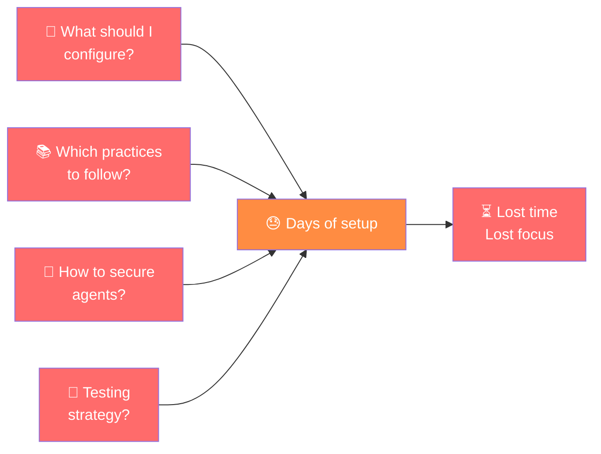
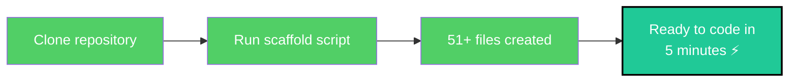
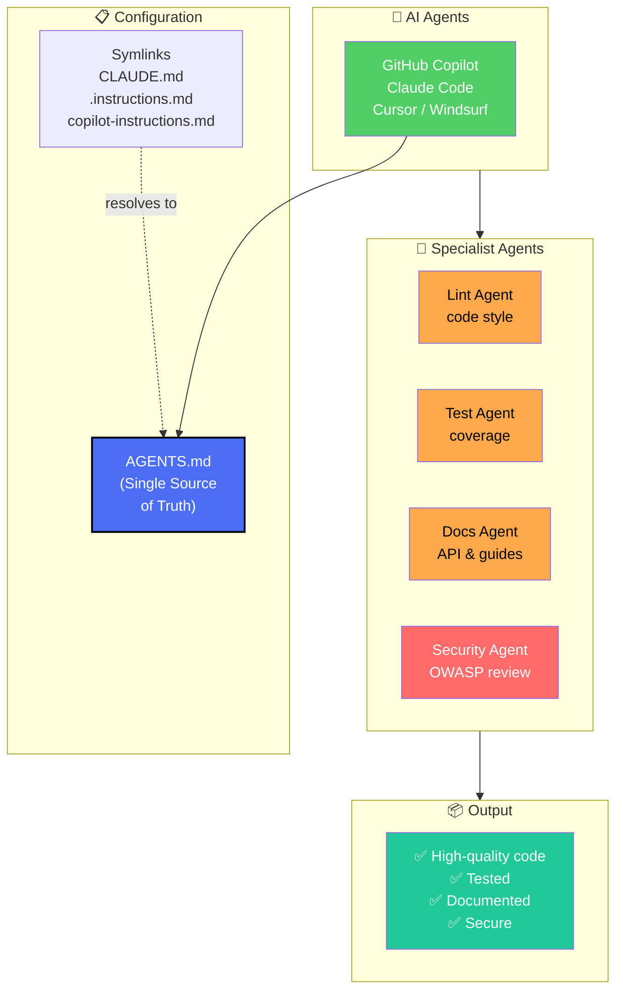
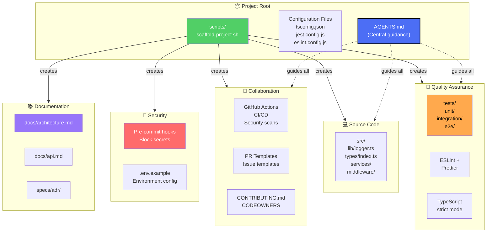

# Agentic Engineering Scaffolding for VS Code

> A **complete TypeScript project template** designed to help developers **start working with agentic engineering** in Visual Studio Code. It provides production-ready configurations, AI agent instructions, security hardening, and best practices—all bootstrapped with a single idempotent script.

[](https://github.com/OWNER/REPO/actions/workflows/ci.yml)
[](LICENSE)
[](#author)

---

## What is this?

This project is your **starting point for agentic engineering with AI assistants** (GitHub Copilot, Claude Code, Cursor, Windsurf). It eliminates days of setup and configuration by providing:

✅ **One-command project initialization** — 51+ files configured automatically
✅ **Unified agent instructions** — GitHub Copilot, Claude, and other AI tools read the same guidance
✅ **Security hardened** — Pre-commit hooks block secrets; OWASP A02 best practices
✅ **TypeScript strict mode** — Full type safety from day one
✅ **80% test coverage threshold** — Jest + ts-jest pre-configured
✅ **Code quality gates** — ESLint, Prettier, type-checking automated
✅ **GitHub workflows** — CI/CD, security scanning, agent personas ready
✅ **VS Code optimized** — Settings, extensions list, tasks configured

---

## Quick start

```bash
# 1. Clone and install
git clone https://github.com/OWNER/REPO.git
cd REPO
npm install

# 2. Run the scaffold (creates 51+ project files)
bash scripts/scaffold-project.sh

# 3. Configure environment
cp .env.example .env
# Edit .env and fill in real values

# 4. Run in development mode
npm run dev

# 5. Run tests
npm test
```

## Project Scaffold

This project is **fully bootstrapped** using an idempotent scaffold script. All project structure, tooling, CI/CD, and agent configurations are defined in a single source of truth.

### Run the scaffold

```bash
bash scripts/scaffold-project.sh          # First run — creates all project files
bash scripts/scaffold-project.sh --force  # Re-run — overwrites existing files
```

### What the scaffold creates

**51+ files across 8 categories:**

| Category | Files | Purpose |
|----------|-------|---------|
| **Instructions** | `AGENTS.md`, `CLAUDE.md`, `.instructions.md`, `.github/copilot-instructions.md` (symlinks) | Single source of truth for all AI agents — minimal, research-backed requirements per arXiv:2602.11988 |
| **Security** | `.gitignore`, `.env.example`, `.github/hooks/pre-commit` | OWASP A02 secrets protection; pre-commit hook blocks accidental commits |
| **GitHub** | PR template, issue templates (bug/feature), workflows (CI/CD, security), CODEOWNERS, agent personas | Standardised collaboration and automation |
| **VS Code** | `settings.json`, `extensions.json`, `tasks.json`, `.editorconfig` | Consistent editor experience across all developers |
| **TypeScript tooling** | `tsconfig.json`, `jest.config.js`, `eslint.config.js`, `.prettierrc.json` | Strict mode, 80% coverage threshold, standardised code style |
| **Source code** | `src/lib/logger.ts`, `src/types/index.ts`, directory structure | Functional patterns, typed utilities |
| **Tests** | `tests/unit/logger.test.ts`, test directories | Example Jest test following best practices |
| **Documentation** | `CONTRIBUTING.md`, `docs/architecture.md`, `docs/api.md`, `specs/`, `CHANGELOG.md`, `LICENSE` | Developer onboarding and project standards |

### Key features

#### Single source of truth via symlinks

All AI agents (GitHub Copilot, Claude Code, VS Code Agent, Cursor, Windsurf) read **one file**: `AGENTS.md`. This is implemented using **symbolic links** (symlinks), not separate files with references.

**Why symlinks instead of file copies or references?**

According to Wikipedia:

> A **symbolic link** is a special file that stores a path to another file, providing "an alternative access path without duplicating the target's content." The file system automatically treats the symlink as an alias to the target — any software reading the link immediately sees the target's content, without needing to know about symlinks.

**Single Source of Truth (SSOT) advantages** (per Wikipedia SSOT article):

> "Single source of truth architecture is the practice of structuring information models such that every data element is mastered (or edited) in only one place." The benefits include "easier prevention of mistaken inconsistencies (such as a duplicate value/copy somewhere being forgotten) and greatly simplified version control."

**Comparison:**

| Approach | Issues |
|----------|--------|
| **File with link reference** (e.g., "See AGENTS.md") | Creates duplication, drift risk, manual updates needed |
| **Symlinks (current)** | Single authoritative file; changes auto-reflect; tools unaware of link overhead |

**Implementation:**
```bash
# All three symlinks point to the same file
CLAUDE.md → AGENTS.md
.instructions.md → AGENTS.md
.github/copilot-instructions.md → ../AGENTS.md
```

When any tool reads `.github/copilot-instructions.md`, the OS automatically resolves the symlink and serves `AGENTS.md`. If `AGENTS.md` is updated, all three paths instantly reflect the change—no manual syncing needed.

- **One source of truth**: AGENTS.md + 3 symlinks (CLAUDE.md, .instructions.md, .github/copilot-instructions.md) — all tools read the same file
- **Minimal, research-backed**: Per arXiv:2602.11988 (Gloaguen et al.), excessive instructions reduce agent task-success by >20%; only essential requirements included
- **Idempotent**: Run multiple times safely; `--force` overwrites, skips unchanged files
- **OWASP A02 hardened**: Pre-commit hook blocks secrets (API keys, certificates, credentials) automatically
- **Agent personas**: Specialised agents for testing, linting, docs, and security in `.github/agents/`
- **Prompt templates**: Reusable guidance in `.github/prompts/` for consistent agent-assisted workflows

---

## How it helps you

### The problem it solves

When starting with **agentic engineering**, developers face challenges:



### The solution

This scaffold **eliminates setup friction**:



---

## Agent orchestration workflow

All AI assistants follow unified instructions and specialized roles:



### Using specialized agents

```bash
# Lint agent — fixes code style automatically
copilot /lint

# Test agent — generates or fixes unit/integration tests
copilot /test

# Docs agent — writes API docs and architecture guides
copilot /docs

# Security agent — reviews code for OWASP Top 10 vulnerabilities
copilot /security
```

---

## Project structure & components



---

## Key benefits for agentic engineering teams

| Benefit | Impact | Why it matters |
|---------|--------|----------------|
| **No setup overhead** | Start coding in 5 min | Focus on business logic, not config |
| **Unified agent guidance** | All tools follow same rules | Consistency across Copilot, Claude, Cursor |
| **Security by default** | Pre-commit blocks secrets | OWASP A02 hardened; no credential leaks |
| **Tested from day 1** | 80% coverage enforced | Confidence in every deployment |
| **Type-safe** | TypeScript strict mode | Catch bugs before runtime |
| **Minimal instructions** | Agents stay focused | Research shows excessive instructions reduce success by >20% |
| **Idempotent scaffold** | Safe to rerun anytime | No accidental overwrites; explicit `--force` flag |
| **GitHub integration** | Workflows + personas | Automated CI/CD, security scans, team workflows |

---

## Scaffolded files reference

<details>
<summary><strong>Complete list of 51+ files created</strong></summary>

**Instructions** (Single source of truth via symlinks)
- `AGENTS.md` — Authoritative agent guidance
- `CLAUDE.md` → `AGENTS.md` (symlink)
- `.instructions.md` → `AGENTS.md` (symlink)
- `.github/copilot-instructions.md` → `../../AGENTS.md` (symlink)

**Security**
- `.gitignore` — Standard Node.js + TypeScript ignores
- `.env.example` — Environment variables template
- `.github/hooks/pre-commit` — Block secrets before commit

**GitHub Automation**
- `.github/workflows/ci.yml` — CI/CD pipeline
- `.github/workflows/security.yml` — Dependency scanning
- `.github/PULL_REQUEST_TEMPLATE.md` — Standard PR format
- `.github/ISSUE_TEMPLATE/bug.md` — Bug report template
- `.github/ISSUE_TEMPLATE/feature.md` — Feature request template
- `.github/CODEOWNERS` — Code ownership rules
- `.github/agents/*.md` — Specialized agent personas

**VS Code Configuration**
- `.vscode/settings.json` — Formatter, linter settings
- `.vscode/extensions.json` — Recommended extensions
- `.vscode/tasks.json` — Build, test, lint tasks
- `.editorconfig` — Editor settings

**TypeScript & Tooling**
- `tsconfig.json` — TypeScript configuration (strict mode)
- `jest.config.js` — Jest test configuration
- `eslint.config.js` — ESLint rules
- `.prettierrc.json` — Code formatter config
- `package.json` — Dependencies and scripts

**Source Code**
- `src/lib/logger.ts` — Logging utility
- `src/types/index.ts` — TypeScript interfaces
- `src/api/` — Route handlers
- `src/db/` — Database layer
- `src/middleware/` — Express/Fastify middleware
- `src/services/` — Business logic

**Tests**
- `tests/unit/logger.test.ts` — Example unit test
- `tests/unit/` — Unit tests directory
- `tests/integration/` — Integration tests directory
- `tests/e2e/` — End-to-end tests directory

**Documentation**
- `docs/architecture.md` — System design
- `docs/api.md` — API reference
- `docs/CONTRIBUTING.md` — Development guide
- `CONTRIBUTING.md` — Contributing guidelines
- `CHANGELOG.md` — Version history
- `README.md` — This file
- `LICENSE` — MIT license
- `specs/README.md` — Specifications directory
- `specs/adr/` — Architecture Decision Records
- `specs/rfc/` — Request for Comments

</details>

---

## Next steps

1. **Run the scaffold**: `bash scripts/scaffold-project.sh`
2. **Read AGENTS.md**: Understand the unified agent guidance
3. **Configure environment**: Copy `.env.example` → `.env`
4. **Run tests**: `npm test` — verify everything works
5. **Start coding**: Edit `src/` with your AI assistant
6. **Review Pull Requests**: See CI/CD, security, and agent workflows in action

See [CONTRIBUTING.md](CONTRIBUTING.md) for full development workflow.

---

## Documentation

### Getting Started
- **[Getting Started Guide](docs/GETTING_STARTED.md)** — Step-by-step setup (5 minutes)
- **[Why Use This?](docs/WHY_USE_THIS.md)** — Benefits and ROI analysis
- **[Quick Start](#quick-start)** — Clone, scaffold, run tests (above)

### Project Reference
- **[Architecture](docs/architecture.md)** — System design and components
- **[API Reference](docs/api.md)** — Generated API documentation
- **[Contributing](CONTRIBUTING.md)** — Development workflow and standards
- **[AGENTS.md](AGENTS.md)** — Unified agent guidance and boundaries
- **[Changelog](CHANGELOG.md)** — Version history

### Resources
- [TypeScript Handbook](https://www.typescriptlang.org/docs/) — Language reference
- [Jest Documentation](https://jestjs.io/docs/getting-started) — Testing framework
- [Conventional Commits](https://www.conventionalcommits.org/) — Commit message standard
- [OWASP Top 10](https://owasp.org/www-project-top-ten/) — Security best practices

---

## <a name="author"></a>Author

**This project was made with ❤️ by Luis Felipe Ariza Vesga**

Designed to help developers and teams accelerate their journey into agentic engineering with AI-powered development assistants in Visual Studio Code.

**Questions or feedback?** Open an issue or check [docs/GETTING_STARTED.md](docs/GETTING_STARTED.md) for help.

---

## License

[MIT](LICENSE) — Free to use, modify, and distribute.

---

**Get started now** →  `bash scripts/scaffold-project.sh` ⚡
# hdd-gsd2-hybrid-framework
