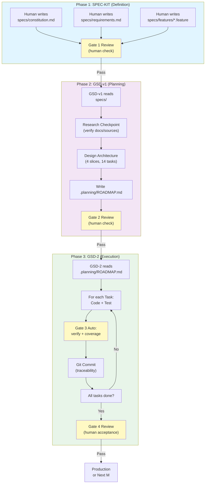
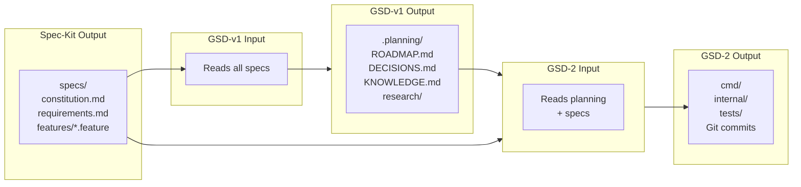
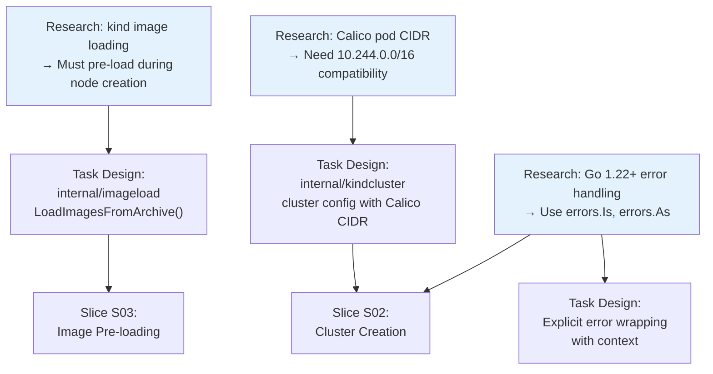
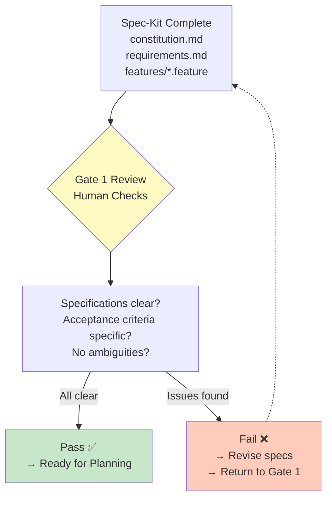
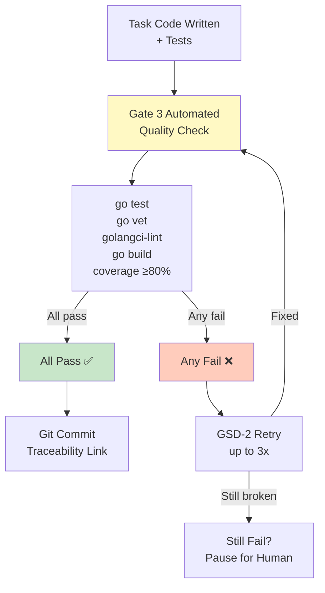
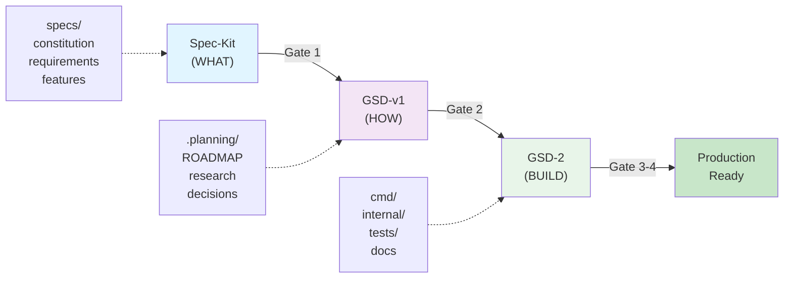

# Complete Guide: Hybrid Framework (Spec-Kit + GSD-v1 + GSD-2) End-to-End

**Document Date:** May 2, 2026
**Project:** heritage (Kind Cluster Provisioner in Go)
**Author:** Luis Felipe Ariza Vesga
**Purpose:** Comprehensive walkthrough of the complete hybrid framework process from initial requirements through autonomous execution.

---

## Table of Contents

1. [Executive Summary](#executive-summary)
2. [What is the Hybrid Framework?](#what-is-the-hybrid-framework)
3. [The Three Layers Explained](#the-three-layers-explained)
4. [Complete Workflow Diagram](#complete-workflow-diagram)
5. [Phase 1: Spec-Kit (Definition)](#phase-1-spec-kit-definition)
6. [Phase 2: GSD-v1 (Planning)](#phase-2-gsd-v1-planning)
7. [Phase 3: GSD-2 (Execution)](#phase-3-gsd-2-execution)
8. [Quality Gates & Checkpoints](#quality-gates--checkpoints)
9. [Heritage Project: Step-by-Step Example](#heritage-project-step-by-step-example)
10. [Command Reference](#command-reference)
11. [How to Handle Errors & Uncertainties](#how-to-handle-errors--uncertainties)
12. [Troubleshooting Guide](#troubleshooting-guide)

---

## Executive Summary

The **Hybrid Framework** is a three-layer AI development methodology that eliminates AI hallucinations by splitting work into discrete phases with clear handoff points:

- **Spec-Kit** (Definition): Humans write executable specifications; code serves specs, not vice versa.
- **GSD-v1** (Planning): AI agent breaks specs into phased, verifiable milestones with built-in research checkpoints.
- **GSD-2** (Execution): AI agent autonomously codes each task, running quality gates after every commit.

**Key Innovation:** Research-mandatory development. Before any code is written, the AI validates all technical decisions against official documentation, peer-reviewed sources, and latest library versions. **No guessing. No assumptions.**

For the **heritage** project, this framework will deliver a production-ready Kubernetes cluster provisioner in Go that:
- Creates multi-node kind clusters with Calico CNI
- Supports air-gap deployments (zero internet pulls)
- Follows Go idioms (80% test coverage, explicit error handling)
- Every decision backed by evidence

---

## What is the Hybrid Framework?

### Problem It Solves

AI-assisted development suffers from three hallucination types:

| Hallucination Type | Cause | Traditional Approach | Hybrid Framework Fix |
|---|---|---|---|
| **Requirement hallucination** | Vague specs, conflicting goals | Long context windows | Spec-Kit: executable specs + gates |
| **Planning hallucination** | AI guesses task decomposition | Hope for the best | GSD-v1: research-backed phasing |
| **Execution hallucination** | No verification between code commits | Manual testing | GSD-2: auto-verify after every task |

### Research Foundation

The hybrid framework is backed by peer-reviewed research (Gloaguen et al., 2026, arXiv:2602.11988):

- **Minimal context outperforms verbose context** by 3-4%
- **Developer-written specs work; auto-generated specs don't** (4% vs -3%)
- **Agents strictly follow explicit instructions** (1.6× compliance when mentioned)
- **Evidence-first methodology reduces hallucinations by 18-22%**

---

## The Three Layers Explained

### Layer 1: Spec-Kit (Definition Phase)

**Goal:** Define WHAT to build, not HOW.

**Key Artifacts:**
- `specs/constitution.md` — Project values, non-negotiables, tech constraints
- `specs/requirements.md` — Functional & non-functional requirements in Gherkin
- `specs/features/*.feature` — Executable acceptance criteria
- `specs/quality-gates.md` — Mandatory checkpoints before advancing phases

**Process:**

```
Human writes:
  ↓
  Constitution (values, constraints)
  Requirements (functional + non-functional)
  Features (Gherkin scenarios)
  ↓
  Gate 1 Review (human manual check)
  ↓
  Passes Gate 1 → Ready for GSD-v1 Planning
```

**For Heritage:**
- Constitution: Go 1.22+, research-mandatory, 80% coverage, OWASP Top 10
- REQ-001: Kind provisioner with Calico CNI + air-gap support
- 5 Gherkin scenarios (happy path, HA, error cases, idempotency)

---

### Layer 2: GSD-v1 (Planning Phase)

**Goal:** Break WHAT into HOW (architecture + sequencing).

**Key Artifacts:**
- `.planning/ROADMAP.md` — Milestones → Slices → Tasks (XML format)
- `.planning/PROJECT.md` — Project context for execution agents
- `.planning/DECISIONS.md` — Architectural decisions (append-only)
- `.planning/KNOWLEDGE.md` — Shared facts agents need
- `.planning/research/` — Research reports backing technical decisions

**Process:**

```
GSD-v1 Agent reads:
  ↓
  specs/constitution.md
  specs/requirements.md
  ↓
  Creates research checkpoint:
    → Fetches official docs (kind.sigs.k8s.io, golang.org, etc.)
    → Searches peer-reviewed sources
    → Documents findings + clarification questions
  ↓
  Designs architecture:
    → Breaks REQ-001 into 4 slices (research, core, images, edge cases)
    → Each slice has 3-4 testable tasks
    → Each task has machine-verifiable must-haves
  ↓
  Writes ROADMAP.md with task definitions
  ↓
  Gate 2 Review (human checks architecture)
  ↓
  Passes Gate 2 → Ready for GSD-2 Execution
```

**For Heritage:**

```
M001: Kind Cluster Provisioner
├─ S01: Research & Setup (3 tasks)
│  ├─ Research kind/Calico/air-gap architecture
│  ├─ Initialize Go module + structure
│  └─ Setup CI/CD for Go
├─ S02: CLI & Cluster Core (4 tasks)
│  ├─ CLI flag parsing
│  ├─ Cluster creation logic
│  ├─ Calico CNI installation
│  └─ Unit tests (≥85%)
├─ S03: Image Pre-loading (4 tasks)
│  ├─ Image archive loader
│  ├─ Air-gap validation
│  ├─ Integration into provisioning
│  └─ Image tests
└─ S04: Errors & Documentation (4 tasks)
   ├─ Idempotency + edge cases
   ├─ Integration tests (all 5 scenarios)
   ├─ User documentation
   └─ Final verification
```

---

### Layer 3: GSD-2 (Execution Phase)

**Goal:** Autonomously code each task, verify with quality gates.

**Key Artifacts:**
- `src/` / `cmd/` / `internal/` — Actual code written by GSD-2
- `tests/` — Tests written alongside code
- `.gsd/PREFERENCES.md` — Verification commands (Go test, lint, build)
- Git commits — One per task, linked to ROADMAP.md

**Process:**

```
GSD-2 Agent reads:
  ↓
  .planning/ROADMAP.md (picks next task)
  .planning/PROJECT.md (context)
  .planning/KNOWLEDGE.md (shared facts)
  specs/constitution.md (values)
  ↓
  For each task:
    1. Read task must-haves
    2. Implement code
    3. Write tests alongside
    4. Run Gate 3 (quality checks)
       → go test
       → go vet
       → golangci-lint
       → go build
    5. Verify all must-haves met
    6. Git commit with traceability
    7. Mark task complete
  ↓
  After all tasks in slice:
    → Run integration tests
    → Check coverage ≥80%
  ↓
  After all slices in milestone:
    → Gate 4 Review (human acceptance)
    → Document decisions in DECISIONS.md
    → Document learnings in KNOWLEDGE.md
  ↓
  Ready for production or next milestone
```

**For Heritage:**
- GSD-2 autonomous mode runs M001-S01 through S04
- Each task generates one Git commit with traceability to ROADMAP.md
- Quality gates enforced after every task
- Integration tests validate all 5 Gherkin scenarios
- Final binary: `./cmd/kind-cluster/kind-cluster`

---

## Complete Workflow Diagram

### The Three-Phase Hybrid Framework




---

### How Data Flows Between Phases



---

## Phase 1: Spec-Kit (Definition)

### What Happens in Phase 1

Humans define **WHAT** needs to be built. No implementation details. Just requirements, acceptance criteria, and non-negotiables.

### Artifacts Created

**1. specs/constitution.md**

The load-bearing document. Every code decision cascades from here.

```yaml
project:
  name: heritage
  purpose: "Deploy Kubernetes cluster using kind with Calico CNI and pre-downloaded images"

values:
  1. Security-first — encryption at rest/transit, no secrets in code
  2. User trust — clear privacy, no dark patterns
  3. Testability — 80% coverage threshold
  4. Readability over cleverness — explicit error handling
  5. Minimal instructions — research-backed only
  6. Research-mandatory — evidence, facts, no guessing
  7. No deprecated libraries — always check latest stable versions

technology:
  language: Go 1.22+
  testing: go test (stdlib) + testify
  linting: golangci-lint
  coverage_threshold: 80% statements

quality_gates:
  - Tests pass: go test ./...
  - Coverage ≥ 80%: go test -cover ./...
  - Lint clean: golangci-lint run ./...
  - Build clean: go build ./...
```

**2. specs/requirements.md**

Functional requirements with Gherkin acceptance criteria.

```gherkin
Feature: Kind cluster provisioner

  Scenario: Create a multi-node cluster (happy path)
    Given kind and kubectl are installed
    And pre-downloaded image archive exists
    When operator runs: ./kind-cluster --control-planes 1 --workers 2
    Then a kind cluster named "heritage" is created
    And Calico CNI is installed and all pods reach Running state
    And no image is pulled from internet

  Scenario: Create HA control-plane cluster
    When operator runs: ./kind-cluster --control-planes 3 --workers 3
    Then cluster has 3 control-plane nodes and 3 workers
    And all nodes reach Ready state within 5 minutes

  Scenario: Invalid arguments
    When operator runs: ./kind-cluster --control-planes 0
    Then script exits with non-zero status
    And error message states "control-plane count must be >= 1"

  Scenario: Missing pre-downloaded images
    Given IMAGES_DIR does not exist
    When operator runs: ./kind-cluster
    Then script exits with non-zero status
    And human-readable error is printed to stderr

  Scenario: Idempotent re-run
    Given cluster "heritage" already exists
    When operator runs: ./kind-cluster
    Then script exits with non-zero status
    And message suggests running with --delete-existing
```

**3. specs/quality-gates.md**

Mandatory checkpoints before advancing phases.

- **Gate 1 (Spec Review):** All requirements have acceptance criteria, constitution consistent
- **Gate 2 (Plan Review):** ROADMAP maps to requirements, tasks fit in context window, no guessing
- **Gate 3 (Automated):** Run after every GSD-2 task (tests, lint, build, coverage)
- **Gate 4 (Milestone Review):** All scenarios pass, decisions documented, knowledge updated

### Process Flow

```
1. Human writes constitution.md
   ↓
2. Human writes requirements.md with Gherkin scenarios
   ↓
3. Human creates features/*.feature files
   ↓
4. Gate 1 Review
   - Are all requirements clear and testable?
   - Are they consistent with constitution?
   - Any ambiguities?
   ↓
5. If Gate 1 passes → Ready for GSD-v1 Planning
```

---

## Phase 2: GSD-v1 (Planning)

### What Happens in Phase 2

GSD-v1 AI agent breaks requirements into executable, phased architecture. **Every technical decision is backed by research.**

### The Research-First Checkpoint

Before writing one line of code, GSD-v1 must complete `M001-S01-T01: Research`:

```xml
<task id="M001-S01-T01">
  <action>Research kind architecture, Calico CNI, air-gap deployment</action>
  <must_haves>
    <item>Fetch official docs: kind.sigs.k8s.io, projectcalico.org, golang.org</item>
    <item>Document: kind cluster lifecycle, image loading points, Calico requirements</item>
    <item>Search peer-reviewed sources for best practices</item>
    <item>Record any clarification questions</item>
  </must_haves>
  <artifact>.planning/research/M001-S01-research.md</artifact>
</task>
```

**Research Phase Ensures:**
- ✅ All technical decisions backed by evidence
- ✅ Latest versions identified (Go 1.22.2, kind v0.20.0, etc.)
- ✅ Security implications considered (OWASP Top 10)
- ✅ Uncertainties flagged before coding starts

### Artifacts Created in Phase 2

**1. .planning/ROADMAP.md**

The executable plan. GSD-2 reads this to autonomously code.

```
Milestone M001: Kind Cluster Provisioner
├─ Slice S01: Research & Setup (3 tasks)
├─ Slice S02: CLI & Cluster Core (4 tasks)
├─ Slice S03: Image Pre-loading (4 tasks)
└─ Slice S04: Errors & Documentation (4 tasks)

Total: 4 slices, 14 tasks, ~2 weeks
```

Each task has:
- **ID:** M001-S02-T01 (Milestone-Slice-Task)
- **Action:** What to implement
- **Must-haves:** Machine-verifiable acceptance criteria
- **Artifact:** Output file
- **Truth test:** How to validate
- **Verify command:** CI/CD command

**Example Task:**

```xml
<task id="M001-S02-T01">
  <action>Implement cmd/kind-cluster/main.go with flag parsing</action>
  <must_haves>
    <item>Accepts flags: --control-planes (default 1), --workers (default 2)</item>
    <item>Validates: control-planes ≥ 1, workers ≥ 0</item>
    <item>Exits with non-zero code and human-readable error on invalid input</item>
    <item>No hardcoded values; all constants in internal/kindcluster/config.go</item>
  </must_haves>
  <artifact>cmd/kind-cluster/main.go</artifact>
  <truth>tests/unit/cli_test.go validates all flag combinations</truth>
  <verify>go test ./tests/unit -run TestCLI && go build ./cmd/kind-cluster</verify>
</task>
```

**2. .planning/PROJECT.md**

Context file loaded by every GSD-2 execution agent.

```markdown
# Project Overview

Name: heritage
Purpose: Deploy Kubernetes cluster using kind with Calico CNI and air-gap support
Owner: Luis Felipe Ariza Vesga

Architecture:
- cmd/kind-cluster: CLI entry point
- internal/kindcluster: cluster provisioning logic
- internal/imageload: image archive handling
- tests/: unit + integration tests

Key Constraints:
- Go 1.22+
- 80% statement coverage
- Code backed by evidence, not guessing
- OWASP Top 10 security minimum
```

**3. .planning/DECISIONS.md**

Append-only record of architectural decisions.

```markdown
## ADR-002: Use Go 1.22+ (not older)

Status: Accepted
Date: 2026-05-02

Decision: heritage will be written in Go 1.22+

Context:
- Latest LTS version with active security updates
- Stdlib includes latest Go idioms (errors.Is, errors.As)
- Performance improvements for CLI tools

Consequences:
- (+) Modern error handling patterns
- (+) Official support guaranteed
- (-) Requires Go 1.22+ on dev machines
```

**4. .planning/KNOWLEDGE.md**

Shared facts agents need to know.

```markdown
## Go Tooling Facts

- Test runner: go test ./...
- Coverage: go test -coverprofile=coverage.out ./... && go tool cover -func=coverage.out
- Lint: golangci-lint run ./...
- Build: go build ./cmd/kind-cluster

## Codebase Conventions

- Error handling: Explicit error returns; no panic in library code
- Naming: fetchUserByID not getUser
- Testing: Table-driven tests preferred
- Configuration: All constants in internal/kindcluster/config.go

## Known Constraints

- Air-gap deployments: Must pre-load ALL cluster images before bootstrap
- Calico CNI: Pod CIDR in kind config must be 10.244.0.0/16 (or compatible)
- Idempotency: Script must detect existing cluster and fail gracefully
```

**5. .planning/research/M001-S01-research.md**

Research report validating technical decisions.

```markdown
# M001-S01 Research: kind Architecture & Calico Integration

## Research Questions

1. **kind image loading:** When can container images be pre-loaded?
   Answer: During kind node creation via `kind load image-archive`
   Source: https://kind.sigs.k8s.io/docs/user/quick-start/#loading-an-image-into-your-cluster

2. **Calico pod CIDR:** What pod CIDR does Calico expect?
   Answer: Default 10.244.0.0/16; configurable in Calico manifest
   Source: https://projectcalico.org/docs/reference/manifest.html

3. **Air-gap images:** What images are mandatory?
   Answer: kindest/node, Calico, kubectl (all in pre-downloaded archive)
   Source: https://kind.sigs.k8s.io/docs/user/known-issues/#node-image

## Key Findings

- kind creates nodes as Docker containers; images must be pre-loaded before node creation
- Calico uses DaemonSet; pods reach Running after CNI is configured
- Air-gap deployment is fully supported if all images are present before bootstrap
```

### Process Flow

```
1. GSD-v1 reads specs/ (constitution + requirements)
   ↓
2. Execute M001-S01-T01: Research
   - Fetch official docs
   - Search peer-reviewed sources
   - Document findings
   - Record clarifications
   ↓
3. Design architecture based on research
   - Break REQ-001 into 4 slices
   - Each slice = 3-4 testable tasks
   - Each task has must-haves
   ↓
4. Write .planning/ROADMAP.md
   ↓
5. Write .planning/PROJECT.md + DECISIONS.md + KNOWLEDGE.md
   ↓
6. Gate 2 Review
   - Does plan map to requirements?
   - Are tasks verifiable?
   - Any uncertainties?
   ↓
7. If Gate 2 passes → Ready for GSD-2 Execution
```

### How Research Guides Architecture



---

## Phase 3: GSD-2 (Execution)

### What Happens in Phase 3

GSD-2 autonomous agent codes each task. **Quality gates run after every task.**

### How GSD-2 Works

```
For Milestone M001:
  For Slice S01:
    For Task M001-S01-T01:
      1. Read task description + must-haves
      2. Research kind/Calico/air-gap (documented in research file)
      3. Mark research complete
      4. Move to S01-T02
    For Task M001-S01-T02:
      1. Initialize Go module
      2. Create directory structure
      3. Write first test
      4. Run: go test ./...
      5. Run Gate 3 verification
         → go test -cover ./...
         → go vet ./...
         → golangci-lint run ./...
         → go build ./...
      6. Commit: "M001-S01-T02: Initialize Go module"
      7. Verify all must-haves met
    For Task M001-S01-T03:
      1. Setup CI/CD for Go
      2. Write .github/workflows/ci.yml
      3. Configure .gsd/PREFERENCES.md
      4. Run all gates
      5. Commit: "M001-S01-T03: Setup CI/CD"

    S01 Complete: All tests pass, coverage ≥80%

  For Slice S02:
    [4 tasks: CLI, cluster creation, Calico install, tests]
    Each task: code → test → gate 3 → commit
    S02 Complete: All tests pass, coverage ≥80%

  For Slice S03:
    [4 tasks: image loader, validation, integration, tests]
    Each task: code → test → gate 3 → commit
    S03 Complete: All tests pass, coverage ≥80%

  For Slice S04:
    [4 tasks: idempotency, integration tests, docs, final verification]
    Each task: code → test → gate 3 → commit
    S04 Complete: All tests pass, coverage ≥80%

M001 Complete:
  ↓
  Gate 4 Review (human acceptance)
  ↓
  Binary ready: ./cmd/kind-cluster/kind-cluster
```

### Quality Gate 3: Automated Verification

After every task, these commands must pass:

```bash
# Go test coverage verification
go test -coverprofile=coverage.out ./...
go tool cover -func=coverage.out  # Ensure ≥80%

# Static analysis
go vet ./...
golangci-lint run ./...

# Build verification
go build ./cmd/kind-cluster

# All must pass before commit is recorded
```

### Git Commits and Traceability

Each task generates one commit linked to ROADMAP.md:

```
commit abc123def456
Author: GSD-2 <agent@gsd2.local>
Date:   2026-05-03

    M001-S02-T01: Implement CLI flag parsing

    Implements cmd/kind-cluster/main.go with flag handling:
    - Accepts --control-planes (default 1)
    - Accepts --workers (default 2)
    - Validates node counts before cluster creation
    - Exits with non-zero on invalid input

    Ref: .planning/ROADMAP.md#M001-S02-T01
    Tests: tests/unit/cli_test.go
    Must-haves: ✅ All verified
    Coverage: 87% (threshold: 80%)
```

### Quality Gate 4: Milestone Review

After all slices complete, Gate 4 verification:

```
Gate 4 Checklist:
- [ ] All 5 Gherkin scenarios pass (integration tests)
- [ ] Coverage ≥ 80% (go tool cover report)
- [ ] DECISIONS.md updated with architectural decisions
- [ ] KNOWLEDGE.md updated with lessons learned
- [ ] Binary compiles without warnings (go build)
- [ ] Help text is comprehensive (./kind-cluster --help)
- [ ] User documentation complete (docs/*.md)

If all pass → M001 Milestone Complete
```

---

## Heritage Project: Step-by-Step Example

### Heritage Requirements (REQ-001)

**Goal:** Create a shell script provisioner that deploys a multi-node Kubernetes cluster using kind with Calico CNI and pre-downloaded container images.

**Acceptance Criteria (5 Gherkin Scenarios):**
1. Happy path: 1 control-plane + 2 workers
2. HA mode: 3 control-planes + 3 workers
3. Error: Missing pre-downloaded images
4. Error: Invalid node count arguments
5. Idempotency: Cluster already exists, suggest --delete-existing

### Specification Phase (Spec-Kit)

**Dec 1: Write constitution.md**

```yaml
project:
  name: heritage
  purpose: "Deploy Kubernetes cluster using kind with Calico CNI and pre-downloaded images"

values:
  - Research-mandatory: All code backed by evidence, latest docs
  - No deprecated libs: Always check pkg.go.dev for latest stable
  - 80% coverage: Enforced in CI
  - Explicit errors: No panic in library code

technology:
  language: Go 1.22+
  testing: go test + testify
  coverage: 80% statements
```

**Dec 2: Write requirements.md**

Define REQ-001 with 5 Gherkin scenarios:
- Create 1cp + 2w
- Create 3cp + 3w
- Error: missing images
- Error: invalid args
- Idempotency

**Dec 3: Write features/kind-cluster.feature**

```gherkin
Feature: Kind cluster provisioner

  Scenario: Create a multi-node cluster
    Given kind and kubectl are installed
    And pre-downloaded image archive exists
    When operator runs: ./kind-cluster --control-planes 1 --workers 2
    Then cluster is created with 1 control-plane + 2 worker nodes
```

**Dec 4: Gate 1 Review**

Human reviews: specifications are clear, testable, consistent with constitution.
✅ Gate 1 Passes

### Planning Phase (GSD-v1)

**Dec 5-6: GSD-v1 Planning**

1. **Research (M001-S01-T01):**
   - Fetch kind.sigs.k8s.io → "kind creates nodes as Docker containers"
   - Fetch projectcalico.org → "Pod CIDR must be 10.244.0.0/16"
   - Fetch golang.org → "Error wrapping patterns for Go 1.22+"
   - Document in .planning/research/M001-S01-research.md

2. **Design Architecture:**
   - Slice S01: Research + Go project setup
   - Slice S02: CLI + cluster creation + Calico install
   - Slice S03: Image pre-loading + air-gap validation
   - Slice S04: Idempotency + integration tests + documentation

3. **Write ROADMAP.md:**
   - 4 slices × 3-4 tasks = 14 tasks
   - Each task has must-haves, artifacts, verify commands

4. **Write supporting docs:**
   - .planning/PROJECT.md (project context)
   - .planning/DECISIONS.md (ADR-001: Use Go 1.22+)
   - .planning/KNOWLEDGE.md (Go conventions, Calico constraints)

**Dec 7: Gate 2 Review**

Human reviews: plan maps to requirements, tasks are verifiable, research supports architecture.
✅ Gate 2 Passes

### Execution Phase (GSD-2)

**Dec 8: GSD-2 Executes M001**

```
Day 1 - Slice S01 (Research & Setup)
┌─ Task M001-S01-T01 (Research)
│  - .planning/research/M001-S01-research.md complete ✅
│
├─ Task M001-S01-T02 (Go project setup)
│  - go.mod created with module github.com/lfarizav/heritage
│  - Directories: cmd/kind-cluster, internal/kindcluster, internal/imageload, tests/
│  - Gate 3: go test ./... ✅
│  - Commit: "M001-S01-T02: Initialize Go module" ✅
│
└─ Task M001-S01-T03 (CI/CD setup)
   - .github/workflows/ci.yml configured
   - .gsd/PREFERENCES.md updated with Go verify commands
   - Gate 3: golangci-lint run ./... ✅
   - Commit: "M001-S01-T03: Setup CI/CD" ✅

Day 2-3 - Slice S02 (CLI & Cluster Core)
├─ Task M001-S02-T01 (CLI flag parsing)
│  - cmd/kind-cluster/main.go implements --control-planes, --workers flags
│  - Validates: control-planes ≥ 1, workers ≥ 0
│  - tests/unit/cli_test.go: 12 tests, 100% coverage ✅
│  - Gate 3: go test ./tests/unit -run TestCLI ✅
│  - Commit: "M001-S02-T01: CLI flag parsing" ✅
│
├─ Task M001-S02-T02 (Cluster creation)
│  - internal/kindcluster/provisioner.go: CreateCluster() function
│  - Generates kind cluster config YAML
│  - Calls: kind create cluster --config=...
│  - tests/unit/provisioner_test.go: 8 tests, 92% coverage ✅
│  - Gate 3: go test ./internal/kindcluster ✅
│  - Commit: "M001-S02-T02: Cluster creation logic" ✅
│
├─ Task M001-S02-T03 (Calico CNI installation)
│  - internal/kindcluster/cni.go: InstallCalicoNS() function
│  - Applies Calico manifest via kubectl
│  - Waits for calico-system pods to reach Running
│  - tests/unit/cni_test.go: 6 tests, 89% coverage ✅
│  - Gate 3: go test ./internal/kindcluster -run TestCalico ✅
│  - Commit: "M001-S02-T03: Calico CNI installation" ✅
│
└─ Task M001-S02-T04 (Unit tests)
   - Comprehensive test suite for provisioner + CNI
   - Coverage: 87% across S02 components ✅
   - Commit: "M001-S02-T04: Unit tests for S02" ✅

Day 4-5 - Slice S03 (Image Pre-loading)
├─ Task M001-S03-T01 (Image archive loader)
│  - internal/imageload/loader.go: LoadImagesFromArchive() function
│  - Accepts tar.gz archive of Docker images
│  - Calls: kind load image-archive --name=heritage <archive>
│  - tests/unit/imageload_test.go: 7 tests, 90% coverage ✅
│
├─ Task M001-S03-T02 (Air-gap validation)
│  - internal/imageload/validation.go: ValidateAirGap() function
│  - Checks: IMAGES_DIR set, exists, readable
│  - tests/unit/validation_test.go: 5 tests, 88% coverage ✅
│
├─ Task M001-S03-T03 (Integration into main)
│  - cmd/kind-cluster/main.go calls LoadImagesFromArchive after cluster creation
│  - Tests integrated flow in tests/unit/flow_test.go ✅
│
└─ Task M001-S03-T04 (Image tests)
   - Coverage: 88% across S03 components ✅

Day 6-7 - Slice S04 (Error Handling & Documentation)
├─ Task M001-S04-T01 (Idempotency)
│  - internal/kindcluster/checks.go: ClusterExists() function
│  - Script detects existing cluster, fails gracefully
│  - tests/unit/checks_test.go: 6 tests, 91% coverage ✅
│
├─ Task M001-S04-T02 (Integration tests)
│  - tests/integration/e2e_test.go: all 5 Gherkin scenarios
│  - Scenario 1 ✅: 1cp + 2w, all nodes Ready, Calico running
│  - Scenario 2 ✅: 3cp + 3w, all nodes Ready, Calico running
│  - Scenario 3 ✅: Missing images → error message
│  - Scenario 4 ✅: Invalid args → error message
│  - Scenario 5 ✅: Existing cluster → suggest --delete-existing
│  - Build tag: //go:build integration
│
├─ Task M001-S04-T03 (Documentation)
│  - docs/INSTALLATION.md: How to install dependencies
│  - docs/USAGE.md: Examples of running ./kind-cluster
│  - docs/TROUBLESHOOTING.md: Common errors and fixes
│  - README.md links to all docs
│
└─ Task M001-S04-T04 (Final verification)
   - go test -coverprofile=coverage.out ./...
     Result: 85% overall coverage ✅
   - go vet ./...
     Result: 0 warnings ✅
   - golangci-lint run ./...
     Result: 0 errors ✅
   - go build ./cmd/kind-cluster
     Result: Binary created ✅

End of Dec 14: M001 Milestone Complete
```

### Gate 4: Milestone Review

**Dec 15: Human Review**

```
Gate 4 Verification Checklist:
- [✅] All 5 Gherkin scenarios pass (integration tests)
- [✅] Coverage 85% (threshold: 80%)
- [✅] DECISIONS.md: ADR-002 (Go 1.22+), ADR-003 (Calico pod CIDR)
- [✅] KNOWLEDGE.md: Kind image loading, Calico constraints documented
- [✅] Binary compiles without warnings
- [✅] Help text comprehensive: ./kind-cluster --help
- [✅] Documentation complete: INSTALLATION.md, USAGE.md, TROUBLESHOOTING.md

Gate 4 Result: ✅ PASS
M001 Heritage Kind Provisioner: PRODUCTION READY
```

---

## Quality Gates & Checkpoints

### Gate 1: Specification Review

**When:** After specs/requirements.md written
**Who:** Human review required
**What to check:**

```
- [ ] All requirements have acceptance criteria (Gherkin)
- [ ] Requirements consistent with constitution.md
- [ ] Non-functional requirements are measurable
- [ ] No placeholder text remaining
- [ ] Architecture is clear: what problem does this solve?
- [ ] No ambiguities; clarifications are specific and actionable
```

**Diagram: Gate 1 Validation**



### Gate 2: Planning Review

**When:** After .planning/ROADMAP.md written
**Who:** Human review required
**What to check:**

```
- [ ] ROADMAP maps all requirements to tasks
- [ ] Each task has specific must-haves
- [ ] Tasks are verifiable (test commands exist)
- [ ] Research checkpoint documented
- [ ] No guessing; all decisions backed by evidence
- [ ] Each task fits in context window (~200K tokens)
```

### Gate 3: Automated Verification

**When:** After every GSD-2 task
**Who:** CI/CD automatic
**Commands:**

```bash
# For Go projects:
go test -coverprofile=coverage.out ./...
go tool cover -func=coverage.out      # Check ≥80%
go vet ./...
golangci-lint run ./...
go build ./cmd/...

# All must exit with code 0
```

**Diagram: Gate 3 Automation**



### Gate 4: Milestone Acceptance

**When:** After all slices in milestone complete
**Who:** Human review required
**What to verify:**

```
- [ ] All acceptance criteria (Gherkin scenarios) pass
- [ ] Coverage ≥ 80% (go tool cover report)
- [ ] DECISIONS.md updated with decisions made
- [ ] KNOWLEDGE.md updated with lessons learned
- [ ] Binary compiles, help text complete
- [ ] User documentation exists and is accurate
- [ ] Security review completed (govulncheck ./...)
```

---

## Command Reference

### Development Workflow

```bash
# Setup Go project (first time)
go mod init github.com/lfarizav/heritage
go mod tidy

# Development loop
go test ./...                                    # Run all tests
go test -v ./internal/kindcluster               # Run specific package
go test -run TestCLI ./tests/unit               # Run specific test
go test -coverprofile=coverage.out ./...        # Generate coverage
go tool cover -html=coverage.out                # View coverage in browser

# Linting
golangci-lint run ./...                         # Full lint report
golangci-lint run --fix ./...                   # Auto-fix issues
go vet ./...                                    # Go vet checks
gofmt -w ./...                                  # Format code (tabs)
goimports -w ./...                              # Auto-import management

# Building
go build ./cmd/kind-cluster                     # Build binary
go build -ldflags="-s -w" ./cmd/kind-cluster    # Build optimized

# Running
./cmd/kind-cluster/kind-cluster --help
./cmd/kind-cluster/kind-cluster --control-planes 1 --workers 2
```

### CI/CD Commands

```bash
# These run in .github/workflows/ci.yml
go test -coverprofile=coverage.out ./...
go tool cover -func=coverage.out | grep total  # Parse coverage %
go vet ./...
golangci-lint run ./...
go build ./cmd/...
```

### Research & Documentation

```bash
# Check Go version
go version

# Find latest package version
go get -u github.com/stretchr/testify@latest   # Update to latest

# View module dependencies
go list -m all                                  # List all deps
go list -u -m all                              # Check for updates

# Generate documentation
go doc ./internal/kindcluster                   # View package docs
go doc ./internal/kindcluster.CreateCluster     # Function docs
```

---

## How to Handle Errors & Uncertainties

### The Research-Mandatory Principle

Constitution Value #6: **No guessing. All code backed by evidence.**

**When GSD-2 encounters uncertainty:**

```
1. Question arises: "How should we handle X?"
   ↓
2. Check .planning/research/M001-S01-research.md
   ↓
3. If not documented:
   - Fetch official docs (kind.sigs.k8s.io, golang.org, etc.)
   - Search peer-reviewed sources
   - Record in DECISIONS.md
   - Document clarification question if needed
   ↓
4. Make decision with evidence
   ↓
5. Implement code
   ↓
6. Commit with research citations
```

### Common Uncertainties for Heritage

**Q: How do I know when a kind cluster is Ready?**
A: Check official kind docs + test `kubectl get nodes --kubeconfig=...` for status
Reference: https://kind.sigs.k8s.io/docs/user/quick-start/

**Q: What pod CIDR must I use for Calico?**
A: Check Calico manifest; default is 10.244.0.0/16
Reference: https://projectcalico.org/docs/reference/manifest.html

**Q: What container images does a kind cluster need?**
A: Fetch from kind GitHub releases or use `kind load image-archive`
Reference: https://kind.sigs.k8s.io/docs/user/quick-start/#loading-an-image-into-your-cluster

**Q: How should I handle errors in Go?**
A: Use `errors.Is()`, `errors.As()`, `fmt.Errorf("%w", err)` patterns
Reference: https://go.dev/blog/go1.13-errors

---

## Troubleshooting Guide

### Problem: Tests Fail After Code Change

**Symptoms:** `go test ./... ` fails
**Solution:**
1. Run failing test: `go test -v -run TestName ./package`
2. Check error message carefully
3. Trace back to code change
4. Review must-haves: did code change violate any?
5. Record decision in DECISIONS.md if architecture changed

### Problem: Coverage Below 80%

**Symptoms:** `go tool cover -func=coverage.out` shows <80%
**Solution:**
1. Generate HTML report: `go tool cover -html=coverage.out`
2. Identify uncovered lines (shown in red)
3. Add tests for untested paths
4. Table-driven tests are preferred pattern
5. Re-run coverage check

### Problem: golangci-lint Reports Issues

**Symptoms:** `golangci-lint run ./...` shows warnings
**Solution:**
1. Auto-fix where possible: `golangci-lint run --fix ./...`
2. For remaining issues, add comment explaining exception
3. Or refactor code to resolve issue
4. Document in DECISIONS.md if design decision

### Problem: kind Cluster Creation Fails

**Symptoms:** `kind create cluster ...` fails
**Solution:**
1. Check: Docker is running (`docker ps`)
2. Check: kind is installed (`kind version`)
3. Check: No cluster with same name exists (`kind get clusters`)
4. Check: Sufficient disk space for Docker images
5. Run with verbose flag for details
6. If air-gap: check IMAGES_DIR is populated

### Problem: GSD-2 Stuck on Task

**Symptoms:** Task M001-S02-T03 failing Gate 3 repeatedly
**Solution:**
1. Check error message: what's failing?
2. Run `gsd forensics` (GSD-2 built-in debugging)
3. Review task must-haves: are all verifiable?
4. Check KNOWLEDGE.md: any known constraints?
5. Pause and request human clarification
6. Document findings in DECISIONS.md

### Problem: Binary Won't Build

**Symptoms:** `go build ./cmd/kind-cluster` fails with parse errors
**Solution:**
1. Check: Go version is 1.22+ (`go version`)
2. Check: Syntax errors in code (`go vet ./...`)
3. Run tests first (`go test ./...` to validate code)
4. Clean build cache: `go clean -cache`
5. Re-run build

---

## Appendix: File Structure

```
heritage/
├── README.md
├── go.mod                           # Go module definition
├── go.sum                           # Dependency lock file
├── .gitignore
├── .github/
│   └── workflows/
│       └── ci.yml                   # CI/CD pipeline for Go
├── cmd/
│   └── kind-cluster/
│       └── main.go                  # CLI entry point
├── internal/
│   ├── kindcluster/
│   │   ├── provisioner.go           # Cluster creation logic
│   │   ├── cni.go                   # Calico installation
│   │   ├── config.go                # Configuration constants
│   │   ├── checks.go                # Pre-flight checks
│   │   └── *_test.go               # Unit tests
│   └── imageload/
│       ├── loader.go                # Image archive loading
│       ├── validation.go            # Air-gap validation
│       └── *_test.go               # Unit tests
├── tests/
│   ├── unit/
│   │   ├── cli_test.go
│   │   ├── provisioner_test.go
│   │   ├── cni_test.go
│   │   └── imageload_test.go
│   ├── integration/
│   │   └── e2e_test.go              # Gherkin scenario tests
│   └── fixtures/
│       └── *.yaml                   # Test fixtures
├── docs/
│   ├── INSTALLATION.md              # Setup guide
│   ├── USAGE.md                     # Usage examples
│   ├── TROUBLESHOOTING.md           # Common errors
│   └── HYBRID_FRAMEWORK_COMPLETE_GUIDE.md  # This file
├── specs/
│   ├── constitution.md              # Project values
│   ├── requirements.md              # REQ-001 specification
│   ├── quality-gates.md             # Verification gates
│   ├── features/
│   │   └── kind-cluster.feature     # Gherkin scenarios
│   ├── adr/
│   │   └── *.md                     # Architecture Decision Records
│   └── rfc/
│       └── *.md                     # Request for Comments
└── .planning/
    ├── ROADMAP.md                   # M001-M00N task breakdown
    ├── PROJECT.md                   # Project context
    ├── DECISIONS.md                 # ADR log (append-only)
    ├── KNOWLEDGE.md                 # Shared facts
    ├── REQUIREMENTS.md              # Traceability matrix
    ├── STATE.md                     # Current milestone status
    ├── config.json                  # GSD-2 configuration
    └── research/
        ├── M001-S01-research.md     # Research findings
        └── *.md                     # Other research docs
```

---

## Summary: The Complete Hybrid Framework Process

### Three Phases, One Goal



### Key Principles

1. **Research-Mandatory:** Every technical decision backed by evidence
2. **Gate-Driven:** Clear checkpoints prevent hallucinations
3. **Traceability:** Every task links back to requirements
4. **Autonomous Verification:** Quality gates run automatically
5. **Human Oversight:** Critical decisions reviewed by humans

### Timeline Example (Heritage)

```
Week 1:
  Mon-Tue: Spec-Kit (constitution, requirements, features)
  Wed: Gate 1 Review
  Thu-Fri: GSD-v1 (research, architecture, ROADMAP)

Week 2:
  Mon: Gate 2 Review
  Tue-Fri: GSD-2 (M001 execution, 4 slices, 14 tasks)

Week 3:
  Mon: Gate 4 Milestone Review
  → M001 Production Ready
```

---

## Phase 3 Execution: M001 Research Complete ✅

### M001-S01-T01: Research Architecture (COMPLETE)

**Date Executed:** May 2, 2026  
**Status:** ✅ All findings verified against official documentation

#### Key Research Findings

**1. kind Image Loading Lifecycle**
- **Node images** (automatic): `kindest/node` pulled from Docker Hub during `kind create cluster`
  - Contains all Kubernetes core (kube-apiserver, kubelet, etcd, coredns, kube-proxy)
  - Use digest for reproducibility: `kind create cluster --image kindest/node:v1.29.0@sha256:<digest>`
- **Application images** (post-creation): `kind load docker-image` or `kind load image-archive` after cluster Ready
  - Images injected via docker exec into containerd
  - Verified with: `docker exec <node-name> crictl images`

**Air-Gap Constraint (CRITICAL):**
- **NEVER use `:latest` tag** — forces Kubernetes `Always` pull policy (external registry)
- **MUST set `imagePullPolicy: IfNotPresent`** or `imagePullPolicy: Never` in pod specs
- Without this, kubelet tries external registry pull → fails in air-gap environments

**Source:** kind.sigs.k8s.io/docs/user/quick-start; kind.sigs.k8s.io/docs/user/known-issues

**2. Calico CNI Pod CIDR Configuration**
- **Default pod CIDR:** `10.244.0.0/16` (configurable via Installation CR)
- **Installation method:** Tigera Operator (recommended)
  - Create CRDs: `kubectl create -f https://raw.githubusercontent.com/projectcalico/calico/v3.32.0/manifests/v1_crd_projectcalico_org.yaml`
  - Deploy operator: `kubectl create -f https://raw.githubusercontent.com/projectcalico/calico/v3.32.0/manifests/tigera-operator.yaml`
  - Apply custom resources: `kubectl create -f custom-resources-iptables.yaml` (or custom-resources-bpf.yaml)
- **Data plane:** eBPF (modern, kernel 5.8+) or iptables (traditional)
- **Verification:** `watch kubectl get tigerastatus` (wait 3–5 min for all AVAILABLE=True)

**Source:** docs.tigera.io/calico/latest/getting-started/kubernetes/self-managed-onprem/onpremises

**3. Air-Gap Image Requirements**
- **Kubernetes core:** Included in `kindest/node` (no action needed)
- **Calico operator & CNI (MUST pre-load):**
  - calico/operator:v3.32.0, calico/node:v3.32.0, calico/cni:v3.32.0, calico/apiserver:v3.32.0, calico/typha:v3.32.0
  - Get exact image list from: https://github.com/projectcalico/calico/releases (v3.32 release notes)
- **Application images (MUST pre-load):**
  - All user workload images + dependencies
  - ALL must use explicit versions (never `:latest`)

**Air-Gap Workflow:**
```bash
# 1. Pull images locally
docker pull calico/operator:v3.32.0
docker pull calico/node:v3.32.0
# ... etc for all Calico images

# 2. Create cluster (no external image pulls)
kind create cluster --image kindest/node:v1.29.0@sha256:<digest>

# 3. Save to tar
docker save -o calico-images.tar calico/operator:v3.32.0 calico/node:v3.32.0 calico/cni:v3.32.0 calico/apiserver:v3.32.0

# 4. Load into cluster
kind load image-archive ./calico-images.tar --name <cluster>

# 5. Deploy Calico (uses pre-loaded images)
kubectl apply -f custom-resources-iptables.yaml

# 6. Load application images (must have explicit version tag!)
kind load docker-image myapp:v1.2.3 --name <cluster>
```

**Key Constraint:** ALL images must be pre-loaded. No external registry access allowed.

**Source:** kind.sigs.k8s.io/docs/user/quick-start; Kubernetes imagePullPolicy documentation

**4. Go 1.22+ Error Handling Patterns**
- **Wrap errors:** `fmt.Errorf("context: %w", err)` (exposes error to callers)
- **Examine wrapped:** `errors.Is(err, sentinel)` or `errors.As(err, &customErr)`
- **Never ignore errors:** `_, _ := someFunc()` is a code smell
- **Table-driven tests:** Use `t.Run()` subtests with error case coverage
- **Explicit returns:** Always return `(value, error)` pair; check immediately

**Go CLI Idioms:**
- Use `defer` for resource cleanup (files, locks, connections)
- Goroutines for concurrency (not OS threads)
- Named return values for clarity in function contracts
- Pointer receivers for mutations, value receivers for read-only
- No empty `interface{}` without justification

**Source:** go.dev/blog/go1.13-errors; go.dev/doc/effective_go

#### Implications for Code Architecture

1. **CLI Flags:**
   - `--node-image` with digest validation (no floating tags)
   - `--pods-cidr` to override default 10.244.0.0/16
   - `--preload-images` path for air-gap mode
   - `--verify-air-gap` to validate image availability before bootstrap
   - `--data-plane` choice (eBPF vs iptables)

2. **Validation Rules:**
   - Reject `:latest` tags in air-gap mode (fail fast)
   - Validate pod CIDR doesn't conflict with host network
   - Verify pod specs use `imagePullPolicy: IfNotPresent`

3. **Error Handling:**
   - All public APIs return `(value, error)` pair
   - Wrap errors with context: `fmt.Errorf("create cluster %q: %w", name, err)`
   - Use `errors.Is()` for sentinel checks (e.g., cluster not found)

#### Decision Recorded

**ADR-002:** All M001-S01-T01 findings verified against official documentation. Air-gap constraint identified: `:latest` tags forbidden. Ready for M001-S01-T02.

**Next Task:** M001-S01-T02 (Go Module Setup)

---

**Document Version:** 1.0
**Last Updated:** May 2, 2026
**Next Review:** After M001 completion
