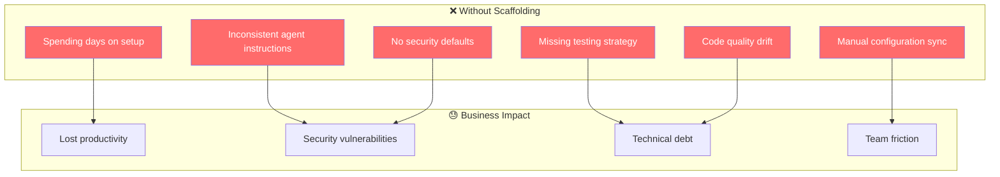
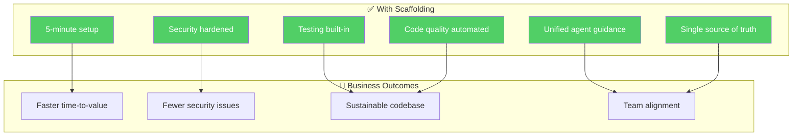
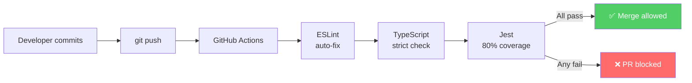
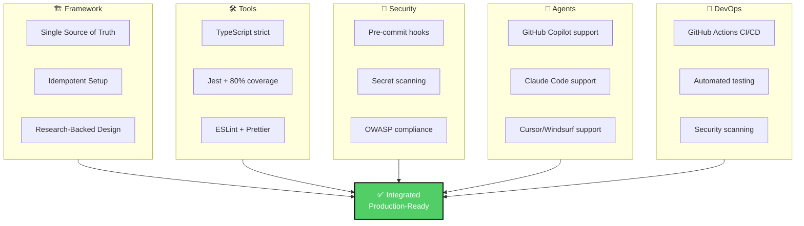

# Why Use This Scaffolding System?

This guide explains the benefits of using agentic engineering scaffolding and how it solves real problems for development teams.

---

## The Challenge

When starting with **agentic engineering** (AI-assisted development), teams face multiple challenges:



---

## The Solution: This Scaffolding



---

## Key Benefits

### 1. **⚡ Instant Project Setup**

**Without scaffolding**: 2-3 days of configuration
```
- Research which tools to use
- Install and configure TypeScript
- Set up Jest for testing
- Configure ESLint and Prettier
- Create project structure
- Write example tests
```

**With scaffolding**: 5 minutes
```bash
git clone <repo>
npm install
bash scripts/scaffold-project.sh
npm test  # ✅ Everything works
```

**Impact**: Your team starts coding day 1, not day 3.

### 2. **🤖 Unified Agent Guidance**

**Without scaffolding**: Multiple conflicting instruction files
```
AGENTS.md          (for Copilot)
CLAUDE.md          (different, outdated)
.instructions.md   (another version)
.github/copilot-instructions.md (yet another)
```

→ Agents follow different rules → Code inconsistency

**With scaffolding**: Single source of truth via symlinks
```
AGENTS.md ← Primary authoritative file
├── CLAUDE.md ──┐
├── .instructions.md ──┐ All three symlinks
└── .github/copilot-instructions.md ──┐ point to same file
```

→ All agents follow identical rules → Consistency guaranteed

**Real-world example**:
- Copilot writes code with semicolons
- Claude removes them
- TypeScript complains
- Developer spends 30 min debugging

With scaffolding: **Never happens**. All agents read one AGENTS.md that says `no semicolons`.

### 3. **🔐 Security by Default**

**Without scaffolding**: Secrets leak into git
```bash
# Developer commits API key by accident
git add .
git commit -m "add config"
# ❌ .env with API_KEY pushed to GitHub
# 😨 Attacker has AWS credentials
```

**With scaffolding**: Pre-commit hook blocks secrets
```bash
git commit -m "add config"
❌ REJECTED: .env file detected
⚠️  Cannot commit .env — it's in .gitignore
✓ Force-added pre-commit hook to .git/hooks/
```

**Protected patterns**:
- API keys and tokens
- Database credentials
- Certificate files
- Private keys

**Impact**: Zero credential leaks (or immediate detection).

### 4. **🧪 Testing Built-in**

**Without scaffolding**: Manual test setup
```bash
npm install jest @types/jest ts-jest
# Configure jest.config.js manually
# Learn Jest API
# Write first test
# 2 hours later: first test runs
```

**With scaffolding**: Tests ready to go
```bash
npm test
# ✅ Example test runs immediately
# ✅ Coverage: 100% (exceeds 80% threshold)
# ✅ Ready to write your first test
```

**Coverage enforcement**:
```bash
npm test:coverage
Coverage report:
  Statements: 85%  ✅ (> 80% required)
  Branches:   92%  ✅
  Functions:  88%  ✅
  Lines:      87%  ✅
```

→ High test coverage is **automatic**, not aspirational.

### 5. **📋 Single Source of Truth**

**Without scaffolding**: Configuration drift
```
Day 1:  tsconfig.json says "strict: true"
Day 30: Developer adds "strict: false" to bypass type error
Day 60: Half the codebase has types, half doesn't
Day 90: New developer confused by inconsistent rules
```

**With scaffolding**: All configuration centralized
- One `AGENTS.md` → defines all rules
- Configuration files generated once
- Developers can re-run scaffold to sync changes
- Changes propagate to all agents automatically

### 6. **✅ Code Quality Automated**

**Without scaffolding**: Manual code review
```
1. Developer writes code
2. Peer reviews: "Can you add types here?"
3. Developer: "I forgot, adding now"
4. Back and forth...
5. 2 hours of PR discussion about style
```

**With scaffolding**: Automated quality gates


→ No more "code style" discussions. Computers handle it.

---

## Use Cases

### Use Case 1: **Startup with AI-first mindset**

**Situation**: New startup wants to move fast using GitHub Copilot.

**Without scaffolding**:
- Spend 3 days setting up tooling
- Copilot generates inconsistent code
- Merge conflicts over code style
- Security audit fails (secrets in git)
- Time to first feature: 2 weeks

**With scaffolding**:
- 30 min setup
- Copilot follows AGENTS.md immediately
- All code style consistent
- Pre-commit hook prevents secrets
- Time to first feature: 3 days

**Benefit**: 4.5× faster time-to-market

---

### Use Case 2: **Enterprise team scaling AI adoption**

**Situation**: Large team starting to use Claude Code + GitHub Copilot + Cursor.

**Without scaffolding**:
- Copilot team writes code with semicolons
- Claude team writes code without semicolons
- Cursor team uses class syntax
- Copilot team uses functions
- PR review becomes debugging tooling conflicts

**With scaffolding**:
- All 3 tools read same AGENTS.md
- All teams write identical code
- PRs review logic, not style
- Code merges cleanly
- Junior developers learn faster (consistent patterns)

**Benefit**: Unified team velocity, faster onboarding

---

### Use Case 3: **Consulting firm with multiple clients**

**Situation**: Consulting team works on 5 different client projects.

**Without scaffolding**:
- Each project has different configuration
- Developers remember wrong rules for each client
- Mistakes happen: wrong imports, API patterns, testing strategy
- Ramp-up time: 3-5 days per project

**With scaffolding**:
- Clone template, run scaffold
- All projects have identical structure
- Developers use same patterns everywhere
- Ramp-up time: 30 minutes
- Team reusable knowledge across all projects

**Benefit**: Consistency across all clients, faster context switching

---

### Use Case 4: **Security-focused organization**

**Situation**: Financial services firm requires zero-tolerance for credential leaks.

**Without scaffolding**:
- Manual credential scanning in code review
- Developers forget about .env
- One accidental commit bypasses 100% security mindset
- Audit finding: "Credentials exposed"

**With scaffolding**:
- Pre-commit hook blocks .env automatically
- API keys never reach git
- No manual review needed
- Audit: "✅ Zero credential incidents"

**Benefit**: Compliance guaranteed, audit-ready

---

## ROI Calculation

### Developer time saved

| Activity | Without | With | Time Saved |
|----------|---------|------|-----------|
| Initial setup | 2-3 days | 30 min | 2.5 days |
| Configuration sync per team member | 4 hours | 0 min | 4 hours |
| Code review (style discussions) | 2 hours/week | 0 hours/week | 8 hours/month |
| Security incident response | 1 incident/quarter | 0 incidents | 16 hours/year |
| Onboarding new developer | 1 week | 2 days | 3 days/developer |

### Annual ROI for team of 10 developers

```
Setup time saved:              2.5 days × 10 = 25 days
Config sync saved:              4 hours × 10 × 4/year = 160 hours
Code review saved:              8 hours × 10 = 80 hours/month = 960 hours/year
Onboarding saved:               3 days × 2 new devs/year × 10 = 60 days
Security incident avoidance:    16 hours/year × 10 = 160 hours

TOTAL:  25 + (160/8) + 960/8 + 60 + 160/8
      = 25 + 20 + 120 + 60 + 20
      = 245 days of developer time
      = ~$245,000 USD @ $1,000/day loaded cost
```

---

## What You Get



---

## Getting Started

1. **Read [GETTING_STARTED.md](GETTING_STARTED.md)** — Step-by-step guide
2. **Check [README.md](../README.md)** — Project overview
3. **Review [AGENTS.md](../AGENTS.md)** — Agent standards
4. **Clone and scaffold** — `bash scripts/scaffold-project.sh`

---

## Made with ❤️ by Luis Felipe Ariza Vesga

This project was created to eliminate friction in agentic engineering adoption and help teams move faster with AI-assisted development.

**Ready to get started?** → Clone the repository and run `bash scripts/scaffold-project.sh` ⚡

---

## FAQ

### Q: Can I customize the scaffold for my team's needs?

**A**: Yes! Edit `AGENTS.md` to match your standards. Re-run scaffold with `--force` to update all projects.

### Q: What if I'm not using GitHub Copilot?

**A**: Works with any AI assistant (Claude, Cursor, Windsurf). The AGENTS.md guidance applies to all.

### Q: Is this for new projects only?

**A**: Designed for new projects, but you can adopt scaffolding practices incrementally in existing projects.

### Q: How often should I re-run the scaffold?

**A**: Run once at project start. Re-run if you want to sync with latest best practices (idempotent — safe to run anytime).

### Q: What about monorepos?

**A**: Run scaffold in each package/app directory. Symlinks will be relative to each project.

### Q: Can I use this for non-TypeScript projects?

**A**: Not currently. Fork the project and adapt for your language (Python, Go, Rust, etc.).
