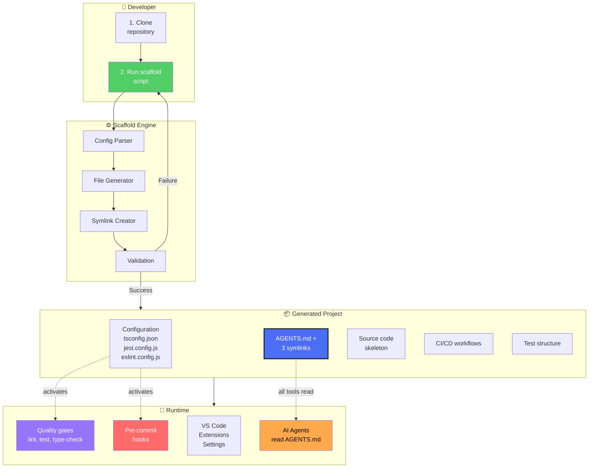
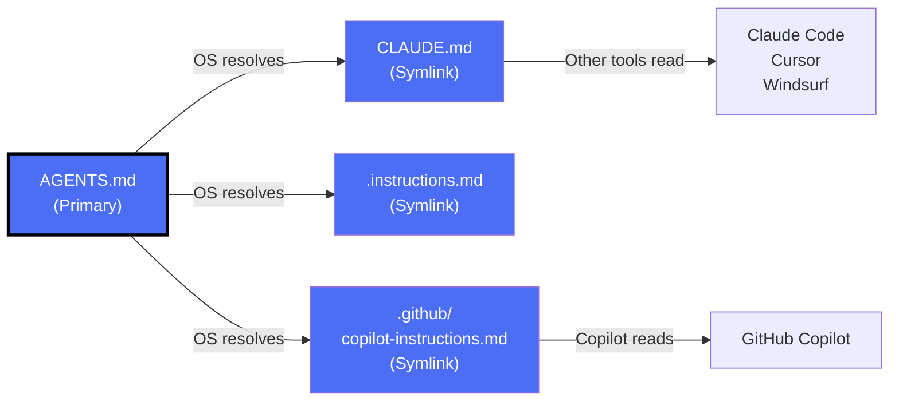
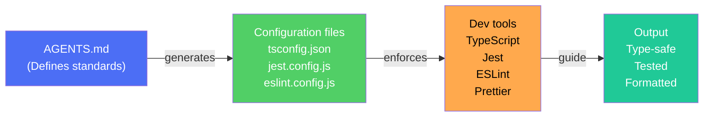
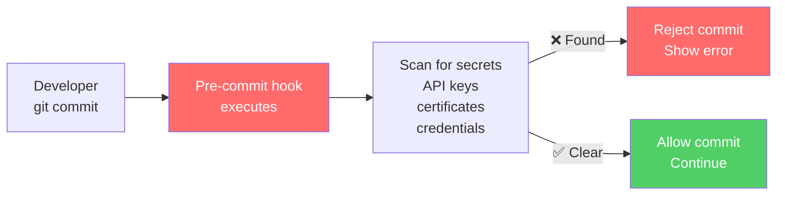
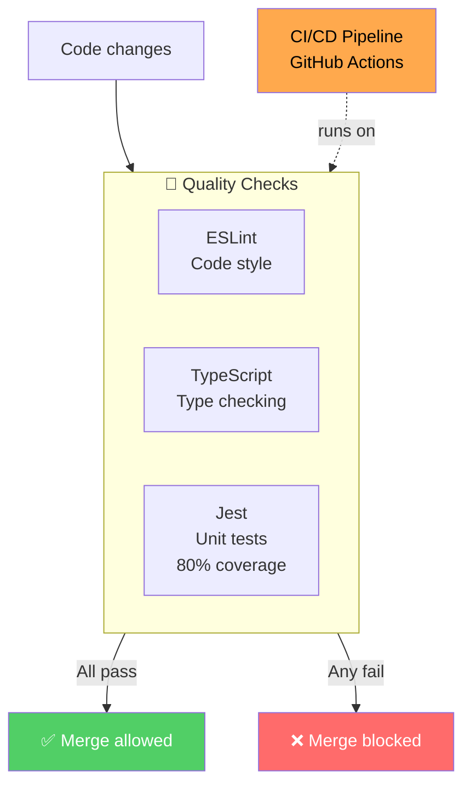
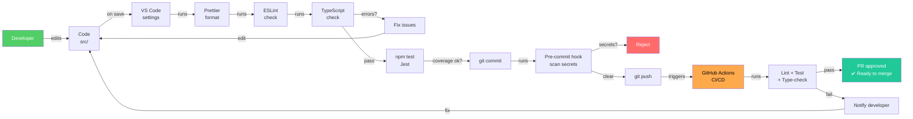

# Architecture

This document describes the high-level design of the Agentic Engineering Scaffolding for VS Code, including system components, data flows, and key architectural decisions.

---

## Overview

The project is designed as a **bootstrapping system** that generates production-ready TypeScript projects with integrated AI agent support. The architecture emphasizes:

- **Single Source of Truth** — One configuration file for all AI agents
- **Modularity** — Independent concerns (security, testing, documentation)
- **Automation** — Minimal manual setup through idempotent scripts
- **Type Safety** — TypeScript strict mode enforced from day one
- **Hybrid Framework** — Three complementary layers eliminate LLM hallucination at every phase of delivery

---

## System architecture



---

## Core components

### 1. Scaffold Script

**Location**: `scripts/scaffold-project.sh`

**Purpose**: Idempotent project generator that creates 51+ files.

**Key features**:
- Runs without dependencies (pure bash)
- `--force` flag for safe re-execution
- Skips unchanged files
- Creates directory structure
- Generates configuration files
- Establishes symlinks for single source of truth

**Pseudocode**:
```bash
scaffold_project() {
  1. Create directory structure
  2. Parse configuration templates
  3. Generate configuration files
     → tsconfig.json, jest.config.js, eslint.config.js
  4. Create AGENTS.md (central guidance)
  5. Create symlinks (CLAUDE.md, .instructions.md, etc.)
  6. Create source code skeleton
  7. Create test structure
  8. Create GitHub workflows
  9. Validate all files created successfully
}
```

### 2. Single Source of Truth (AGENTS.md)

**Location**: `AGENTS.md` + 3 symlinks

**Purpose**: Unified guidance for all AI agents (GitHub Copilot, Claude Code, Cursor, Windsurf).

**Architecture**:


**Content structure**:
- **Testing**: Jest configuration, 80% coverage requirement
- **Code style**: TypeScript strict, single quotes, no semicolons, 2-space indent
- **Git workflow**: Branch naming, Conventional Commits, squash-merge policy
- **Boundaries**: What agents can and cannot do
- **Security**: OWASP compliance, secret handling

### 3. Specialized Agents

**Concept**: Each agent has a specific role and reads from AGENTS.md.

**Agents**:

| Agent | Role | Reads From | Output |
|-------|------|-----------|--------|
| Lint Agent | Fix code style | `AGENTS.md` | Fixed TypeScript/config files |
| Test Agent | Write tests | `AGENTS.md` | Unit/integration test files |
| Docs Agent | Write documentation | `AGENTS.md` | API docs, architecture guides |
| Security Agent | Review vulnerabilities | `AGENTS.md` | Security audit report |

**Invocation**:
```bash
@copilot /lint          # Fix style issues
@copilot /test          # Generate or fix tests
@copilot /docs          # Write documentation
@copilot /security      # Security review
```

### 4. Configuration Layer

**Purpose**: Consistent tool behavior across all developers and CI/CD environments.

**Key files**:

| File | Purpose | Behavior |
|------|---------|----------|
| `tsconfig.json` | TypeScript compiler | Strict mode, ES2020 target, JSDoc support |
| `jest.config.js` | Test runner | `ts-jest` preset, 80% coverage threshold |
| `eslint.config.js` | Code linter | Flat config, @typescript-eslint parser |
| `.prettierrc.json` | Code formatter | Single quotes, no semicolons, 2-space indent |
| `.editorconfig` | Editor settings | Indent style, line endings, trim whitespace |

**Inheritance chain**:


### 5. Security Layer

**Pre-commit hooks**: Block secrets before they reach git.

**Mechanism**:


**Files**:
- `.github/hooks/pre-commit` — Bash script that detects patterns
- `.gitignore` — Exclude `.env`, `*.key`, etc.
- `.env.example` — Template for safe configuration

### 6. Quality Gates

**Automated checks** to maintain code quality:



---

## Directory structure

| Path | Purpose | Contains |
|------|---------|----------|
| `scripts/` | Bootstrap & utilities | `scaffold-project.sh` |
| `src/` | Application source code | TypeScript modules |
| `src/api/` | HTTP handlers | Route controllers |
| `src/db/` | Database layer | Models, migrations, queries |
| `src/lib/` | Shared utilities | Logger, helpers (no side effects) |
| `src/middleware/` | Request handlers | Auth, logging, error handling |
| `src/services/` | Business logic | Domain-specific logic |
| `src/types/` | Type definitions | Interfaces, enums |
| `tests/` | Test suites | Unit, integration, e2e tests |
| `docs/` | Documentation | Architecture, API reference |
| `specs/` | Specifications | ADRs, RFCs |
| `.github/` | GitHub integration | Workflows, templates, CODEOWNERS |
| `.vscode/` | Editor config | Settings, extensions, tasks |

---

## Data flow: Development workflow



---

## Hybrid Framework Architecture

The project implements a **three-layer hybrid framework** that targets the four root causes of LLM hallucination in software development. Each layer is active in a different phase; no two layers operate simultaneously.

```mermaid
graph LR
    subgraph Layer1["Layer 1 — Spec-Kit (Define)"]
        SK1["specs/constitution.md"]
        SK2["specs/requirements.md"]
        SK3["specs/quality-gates.md"]
        SK4[".specify/memory/"]
    end

    subgraph Layer2["Layer 2 — GSD-v1 (Plan)"]
        GV1[".planning/ROADMAP.md"]
        GV2[".planning/DECISIONS.md"]
        GV3[".planning/KNOWLEDGE.md"]
        GV4[".planning/config.json"]
    end

    subgraph Layer3["Layer 3 — GSD-2 (Execute)"]
        G2[".gsd/PREFERENCES.md"]
        G2db[".gsd/gsd.db (SQLite)"]
    end

    Layer1 -->|Gate 1 sign-off| Layer2
    Layer2 -->|Gate 2 sign-off| Layer3

    style Layer1 fill:#4c6ef5,color:#fff
    style Layer2 fill:#51cf66,color:#fff
    style Layer3 fill:#ffa94d,color:#000
```



### Layer 1 — Spec-Kit: Eliminates Ambiguity

**Root cause addressed:** Ambiguity exploitation — the model fills underspecified requirements with training priors.

| File | Purpose |
|------|---------|
| `specs/constitution.md` | Non-negotiable values; cascades to every downstream decision |
| `specs/requirements.md` | Gherkin-style acceptance criteria; verifiable, not vague |
| `specs/quality-gates.md` | 4 mandatory gates before phase transitions |
| `.specify/memory/GOVERNANCE.md` | Constitutional context pre-loaded by Spec-Kit agents |
| `.specify/memory/ARCHITECTURE.md` | Architecture context; updated after each milestone |

**Install:** `uv tool install specify-cli --from 'git+https://github.com/github/spec-kit.git'`

### Layer 2 — GSD-v1: Controls Context at Execution Time

**Root cause addressed:** Context pollution — accumulated session garbage overrides earlier decisions.

| File | Purpose |
|------|---------|
| `.planning/ROADMAP.md` | Milestone → slice → XML task plans with explicit `<must_haves>` |
| `.planning/DECISIONS.md` | Append-only ADR log; pre-loaded by every execution agent |
| `.planning/KNOWLEDGE.md` | Minimal project facts (per arXiv:2602.11988) |
| `.planning/config.json` | Model, verification commands, constitution path |

**Key mechanism:** Fresh 200K context per subagent. Each task agent starts clean; orchestrator context stays lean.

**Install:** `npx get-shit-done-cc@latest` (no global install required)

### Layer 3 — GSD-2: State Machine Across Sessions

**Root cause addressed:** State amnesia — multi-session work contradicts earlier decisions.

| File | Purpose |
|------|---------|
| `.gsd/PREFERENCES.md` | Model routing per phase, budget ceiling, auto-verify commands |
| `.gsd/gsd.db` | SQLite state machine — authoritative source of truth (not committed) |

**Key mechanism:** All milestones, slices, tasks, and decisions live in SQLite. Markdown files are rendered projections, not runtime state.

**Install:** `npm install -g gsd-pi@latest`

### Handoff Model

```
Spec-Kit active:   ████████░░░░░░░░░░░░░░░░░░░░░
GSD-v1 active:     ░░░░░███████████░░░░░░░░░░░░░
GSD-2 active:      ░░░░░░░░░░░░░░████████████░░░
                   │             │             │
                   Define        Plan          Execute
                   (Gate 1)      (Gate 2)      (Gate 3+4)
```

No two frameworks are active simultaneously. Handoffs are file-based — no API integration, no shared runtime. Each framework reads files the previous framework wrote.

### Scaffold Scripts

| Script | Purpose | Files created |
|--------|---------|--------------|
| `scripts/scaffold-project.sh` | Base project (TypeScript, CI/CD, AGENTS.md) | 51+ |
| `scripts/scaffold-hybrid-framework.sh` | Three-layer hybrid framework | 15 |

---

## Key architectural decisions

### 1. Single Source of Truth via Symlinks

**Decision**: Use symlinks instead of file copies for `AGENTS.md`.

**Rationale**:
- Avoids duplication and drift
- Changes to AGENTS.md auto-reflect everywhere
- No manual syncing required

**Trade-off**: Symlinks may not work on all Windows setups (mitigated by .github/workflows/validate-symlinks.yml).

### 2. Minimal, Research-Backed Instructions

**Decision**: Include only essential guidance in AGENTS.md.

**Rationale**: Per arXiv:2602.11988 (Gloaguen et al., 2026), excessive instructions reduce agent task success by >20%.

**Trade-off**: Developers need to review documentation for detailed guidance; not all patterns are encoded in AGENTS.md.

### 3. Idempotent Scaffold Script

**Decision**: Script can be run multiple times safely.

**Rationale**:
- Developers can re-run to update scaffolding
- No risk of accidental file loss
- Explicit `--force` flag for overwrites

**Trade-off**: Slight complexity in bash script to detect and skip unchanged files.

### 4. TypeScript Strict Mode from Day One

**Decision**: No `any` types, no optional properties, full type safety.

**Rationale**:
- Catches bugs at compile time
- Improves code quality
- Aligns with agentic engineering best practices

**Trade-off**: Requires more upfront type definitions; may feel verbose initially.

### 6. Hybrid Framework: Sequential Phases, File-Based Handoffs

**Decision**: Spec-Kit → GSD-v1 → GSD-2 operate in strict sequence with file-based handoffs, never simultaneously.

**Rationale**: Each framework targets a different root cause of LLM hallucination. Overlapping operation creates split-brain state (markdown vs. SQLite). Sequential operation with gate reviews ensures quality without integration complexity. Evidence base: `docs/FEASIBILITY_STUDY.md`.

**Trade-off**: Requires process discipline; not suitable for projects shorter than 6 weeks (setup overhead exceeds benefit).

---

## See also

- [README.md](../README.md) — Project overview and quick start
- [AGENTS.md](../AGENTS.md) — Agent guidance and boundaries
- [Hybrid Framework Guide](../HYBRID_FRAMEWORK_GUIDE.md) — Full integration guide
- [Feasibility Study](FEASIBILITY_STUDY.md) — Research basis for the hybrid approach
- [API Reference](api.md) — Generated API documentation
- [CONTRIBUTING.md](../CONTRIBUTING.md) — Development workflow
